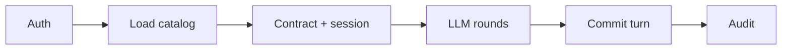

# Zeus Client Python Library

Python client library for Zeus AI data servers. Orchestrates LLM agents that call Zeus tools — catalog sync, auth, contracts, durable sessions, and the full agent loop — without any web UI.

## Install

```bash
pip install kotenai-zeus-client
```

Development install:

```bash
git clone https://github.com/koten-ai/zeus_client_python.git
cd zeus_client_python
pip install -e ".[dev]"
```

## Agent flow

One `run_agent` call executes a single user turn through these phases:



1. **Auth** — `resolve_zeus_auth` mints or reuses Zeus session headers (per scope when configured).
2. **Load catalog** — `load_chat_request` resolves a stamped `chat_request` from the user sync dir, then bundled package data. If the on-disk file has no `## SCOPE BRIEF`, the client borrows the live brief from Zeus and merges it in (brief content is stripped before hashing).
3. **Contract + session** — `resolve_contract_for_scope` binds `contract_id` / `contract_hash` from config. When durable sessions are enabled, the client creates a new `/v2/session` or rehydrates an existing one, preferring the server-stamped hash embedded in the catalog file.
4. **LLM rounds** — multi-round tool loop: provider chat completion → Zeus dispatch (V1 tools or V2 verbs) → optional hook interception.
5. **Commit turn** — per-dispatch trace shards plus a turn shard via `post_session_trace` / `continue_session_turn`.
6. **Audit** — runtime contract checks appended to `trace["notes"]`.

Pass `zeus_session_id` and `zeus_round` from the prior turn's `session_meta` to continue a durable session across questions.

## Quick start

Sync catalogs from your Zeus server once (recommended before the first agent run):

```python
import asyncio
from zeus_client import (
    ZeusClient,
    load_config,
    resolve_llm_provider_config,
    resolve_zeus_config,
    run_agent,
    sync_chat_requests,
)


async def main():
    async with ZeusClient():
        cfg = await load_config()
        zcfg = resolve_zeus_config(cfg)

        # Pull stamped chat_request snapshots into ~/.config/zeus_client/chat_requests/
        result = await sync_chat_requests(cfg)
        print(f"Synced {len(result.synced)} catalog(s)")

        provider = resolve_llm_provider_config(cfg)
        sample = cfg["samples"][cfg["default_sample"]]

        answer, trace, turns, session_meta = await run_agent(
            zcfg["url"], zcfg,
            provider["base_url"], provider["api_key"], provider["models"][0],
            cfg.get("default_api_version", "v2"),
            cfg.get("default_mode", "analytics"),
            sample["bucket"], sample["scope"], sample["collection"],
            "How many breweries are in the dataset?",
            prior_turns=[],
        )
        print(answer)
        print("Session:", session_meta.get("session_id"))


asyncio.run(main())
```

See [`examples/minimal_agent.py`](examples/minimal_agent.py) for a shorter variant that skips sync (uses bundled catalogs).

## Configuration

On first run, `load_config()` creates `~/.config/zeus_client/config.json` from the bundled example template (`src/data/config.example.json`).

Override the config directory:

```bash
export ZEUS_CLIENT_CONFIG_DIR=/path/to/my/config
```

### Zeus connection

Zeus settings live under a single top-level `zeus` object. Use `resolve_zeus_config(cfg)` in code to read it (applies runtime overrides such as `ZEUS_URL`).

```json
"zeus": {
  "url": "http://localhost:8080",
  "auth_mode": "none",
  "username": "",
  "password": "",
  "bearer_token": "",
  "session_id": "",
  "notes": "",
  "scope_credentials": {
    "beer-sample/_default": { "username": "", "password": "" }
  },
  "scope_contracts": {
    "beer-sample/_default": {
      "contract_id": "",
      "contract_hash": ""
    }
  },
  "enable_durable_sessions": true
}
```

| Key | Purpose |
|-----|---------|
| `url` | Zeus server base URL |
| `auth_mode` | `none`, `basic`, `bearer`, or `session` |
| `username` / `password` | Global basic auth (overridden per scope when `scope_credentials` is set) |
| `bearer_token` | Static bearer token when `auth_mode` is `bearer` |
| `session_id` | Reuse an existing Zeus session when `auth_mode` is `session` |
| `scope_credentials` | Per-scope basic auth, keyed by `bucket/scope` |
| `scope_contracts` | Per-scope contract bindings (`contract_id`, `contract_hash`, mode keys) |
| `enable_durable_sessions` | Create/rehydrate `/v2/session` across agent turns |

Runtime URL override (not written back to `config.json`):

```bash
export ZEUS_URL=http://localhost:8080
```

### LLM provider

LLM settings live under a single top-level `llm_provider` object. Use `resolve_llm_provider_config(cfg)` in code to read it.

```json
"llm_provider": {
  "label": "xAI Grok",
  "base_url": "https://api.x.ai/v1",
  "api_key": "",
  "models": [
    "grok-4-1-fast-non-reasoning",
    "grok-4-1-fast-reasoning",
    "grok-4",
    "grok-3-mini"
  ]
}
```

| Key | Purpose |
|-----|---------|
| `label` | Display name for logs and tooling |
| `base_url` | OpenAI-compatible chat completions endpoint |
| `api_key` | Provider API key |
| `models` | Model IDs to choose from; pass `models[0]` (or another entry) to `run_agent` |

Any OpenAI-compatible endpoint works — point `base_url` and `api_key` at your provider and list the model IDs you want to use.

### Catalog sync

`chat_requests_sync` in config controls background catalog pulls:

| Key | Default | Meaning |
|-----|---------|---------|
| `scopes` | `"from_samples"` | Scopes to sync: `"from_samples"`, `"from_contracts"`, or `["bucket/scope", ...]` |
| `modes` | `"auto"` | Modes to fetch: `"auto"` (union of bundled + `scope_contracts` keys) or `["analytics", "code", ...]` |
| `on_startup` | `false` | Reserved for apps that want sync on launch |

Synced files land under `~/.config/zeus_client/chat_requests/{bucket}__{scope}/` with a `manifest.json` fingerprint. `load_chat_request` prefers scope-specific synced files over bundled snapshots.

### Contract hashes

In the normal flow you do **not** compute hashes on the client. Verify a standardized V2 `chat_request` with Zeus (Catalog → "Verify with Zeus"), save the stamped response, and sync or copy it into your catalog dir. The stamped `contract.hash` (or `_hash`) is what session create and drift checks use.

`compute_contract_hash` remains for offline diagnostics and legacy unstamped files only.

## Structured responses

Pass `structured=True` to `run_agent` to receive schema-filtered Zeus rows alongside the natural-language answer:

```python
answer, trace, turns, meta, structured = await run_agent(
    zcfg["url"], zcfg,
    provider["base_url"], provider["api_key"], provider["models"][0],
    "v2", "analytics",
    sample["bucket"], sample["scope"], sample["collection"],
    "List the top Colorado breweries by name.",
    prior_turns=[],
    structured=True,
)

print(structured.answer)       # same as answer (summary from return verb)
print(structured.zeus_data)    # [{"id": "n_...", "name": "...", ...}, ...]
print(structured.decomposition)  # structured query understanding (if model emitted it)
print(structured.warnings)     # dropped unknown fields, missing schema, etc.
```

`zeus_data` rows are extracted from the last successful Zeus data tool call in `trace["tool_calls"]` (`find`, `search`, `pipeline`, `project`, etc.) and filtered to fields allowed by:

1. `output_schema` argument to `run_agent` (highest precedence), e.g. `{"entity_type": "Hotel", "fields": ["id", "name", "rating"]}`
2. `guidance.injections.output_schema` in the loaded chat_request (operator-defined, hash-excluded)
3. MINI-SCHEMA from the scope brief (`get_mini_schema`)

Reserved fields `id`, `doc_key`, and `entity_type` are always kept. FK join columns like `brewery_id.name` are kept when the prefix matches an `entity_fk` in MINI-SCHEMA. Unknown fields are dropped and listed in `structured.warnings` (also appended to `trace["notes"]` as `[WARN] …`).

You can also call `extract_structured_response(answer, trace, chat_req)` directly after a normal `run_agent` turn without re-running the agent.

Default `structured=False` preserves the original 4-tuple return value for backward compatibility.

## Crawl / Walk / Run

Subclass `AgentHooks` and pass `hooks=MyHooks()` to `run_agent` to observe or steer the loop without forking core logic:

| Level | Hook | Use |
|-------|------|-----|
| **Crawl** | `observe(event, data)` | Log structured events (`run_start`, `zeus_result`, `final_answer`, …) |
| **Walk** | `before_zeus_dispatch`, `after_zeus_dispatch` | Mutate tool args or rewrite results before the LLM sees them |
| **Run** | `on_round_start`, `on_ai_response`, `should_continue` | Stop early, inject messages, or cap rounds via `AgentDecision` |

## Public API

Key exports from `import zeus_client`:

| Symbol | Purpose |
|--------|---------|
| `run_agent` | One user turn: LLM + Zeus tools + session/trace; optional `structured=True` for `zeus_data` |
| `StructuredAgentResponse`, `extract_structured_response` | Parse trace into schema-filtered rows |
| `AgentHooks`, `AgentDecision` | Crawl/Walk/Run hook points |
| `load_config`, `save_config`, `resolve_zeus_config`, `resolve_llm_provider_config` | Config management |
| `sync_chat_requests`, `SyncResult` | Pull stamped catalogs from Zeus |
| `load_chat_request`, `list_chat_requests` | Catalog loading and discovery |
| `resolve_contract_for_scope` | Contract binding |
| `compute_contract_hash`, `extract_stamped_hash` | Stamped hash read + offline fallback |
| `resolve_zeus_auth`, `invalidate_zeus_session` | Zeus authentication |
| `dispatch_zeus_call`, `dispatch_zeus_tool`, `dispatch_zeus_v2_verb` | Zeus API calls |
| `create_zeus_session`, `continue_session_turn` | Durable sessions |
| `rehydrate_session`, `post_session_trace` | Session rehydrate and trace shards |
| `ZeusClient` | Async context manager for HTTP lifecycle |

Initialize HTTP manually if not using `ZeusClient`:

```python
from zeus_client import init_http, close_http

await init_http()
# ... your code ...
await close_http()
```

## Error handling

The client uses three strategies depending on severity:

| Strategy | When | What you see |
|----------|------|--------------|
| **Fatal `RuntimeError`** | Misconfiguration or unreachable Zeus before a turn can start | Exception propagates; the call aborts |
| **Structured JSON `error` codes** | Zeus tool/session HTTP transport failures | Status `0` plus `{"error": "<code>", "message": "..."}` in the response body; the agent loop continues and surfaces the body to the LLM |
| **Soft / trace errors** | Non-fatal session, trace, or LLM issues during a turn | Recorded in `trace["notes"]`, `trace["session_error"]`, or returned as a user-facing answer string; the turn may still complete |

Inspect `trace` after `run_agent` for session drift, auth re-mint notes, and the runtime contract audit block.

### HTTP client lifecycle

| Message / code | Likely cause | Fix |
|----------------|--------------|-----|
| `HTTP client not initialised (lifespan not run)` | `client()` called before `init_http()` or outside `async with ZeusClient()` | Wrap calls in `async with ZeusClient():` or call `await init_http()` at startup and `await close_http()` on shutdown |

### Configuration (`load_config`)

| Message / code | Likely cause | Fix |
|----------------|--------------|-----|
| `config.json is not valid JSON at line …` | Trailing commas, `//` comments, or other invalid JSON in `~/.config/zeus_client/config.json` | Repair the file; use a `_comment` string key instead of comments |

### Zeus authentication (`resolve_zeus_auth`)

| Message / code | Likely cause | Fix |
|----------------|--------------|-----|
| `The URL … looks like a Zeus Client address (port 8091/9999)` | `zeus.url` points at the Python client UI/nginx, not the Engine API | Set `zeus.url` to the Engine base URL (typically `http://<host>:8080`) or `export ZEUS_URL=…` |
| `bearer mode selected but bearer_token is empty` | `auth_mode` is `bearer` with no token | Set `zeus.bearer_token` in config |
| `session mode selected but session_id is empty` | `auth_mode` is `session` with no id | Set `zeus.session_id` to a valid Zeus session |
| `basic mode needs a bucket+scope` | `resolve_zeus_auth` called without bucket/scope in basic mode | Pass bucket and scope from your sample; basic login is per-scope (`POST /v1/{bucket}/{scope}/auth/session`) |
| `no credentials for scope {bucket}/{scope}` | No username for that scope | Add `zeus.scope_credentials["{bucket}/{scope}"]` or global `zeus.username` / `zeus.password` |
| `proxy_auth credentials differ from Zeus username/password` | nginx and Zeus need different Basic credentials but share one `Authorization` header | Use identical htpasswd + `zeus_users` credentials, or configure nginx to skip `auth_basic` on `/v1/*/auth/session` and `/readyz` |
| `Zeus unreachable at {url}: …` | DNS, firewall, or Zeus down; `httpx` connect/timeout error | Verify host, port, and that Zeus Engine is running |
| `HTTP 401 from an nginx reverse proxy …` | nginx rejected the request before it reached Zeus | Add `zeus.proxy_auth` (or `proxy_auth_username` / `proxy_auth_password`) for the nginx gate |
| `Zeus login failed ({status}): …` | Wrong username/password, scope mismatch, or Zeus auth error | Confirm credentials exist in `Zeus scope user store`; check Zeus logs and response body |
| `Zeus login returned no session_id` | Login returned 200 but body lacked `session_id` | Inspect Zeus `/v1/{bucket}/{scope}/auth/session` response; upgrade or repair Zeus |
| `unknown auth mode: {mode}` | Invalid `zeus.auth_mode` | Use `none`, `basic`, `bearer`, or `session` |

**401 self-heal:** During tool dispatch, a `401` in basic mode triggers `invalidate_zeus_session` + forced re-login and one retry. Failure is noted in `trace["notes"]` as `auth: re-mint after 401 failed (…)`.

### Catalog loading

| Message / code | Likely cause | Fix |
|----------------|--------------|-----|
| `no chat_request file for mode '{mode}'` | No synced or bundled catalog for that mode/scope | Run `sync_chat_requests(cfg)` or add the file under `~/.config/zeus_client/chat_requests/` |
| `HTTP {status}` (live brief fetch) | Zeus `/v1/ai/chat_request.json` failed while borrowing a scope brief | Non-fatal: agent continues with on-disk catalog; fix Zeus URL/auth and sync catalogs |
| `bootstrap HTTP {status}: …` | Scope bootstrap endpoint failed | Check Zeus URL, auth, and that the scope exists |
| `chat_request HTTP {status}: …` | Catalog fetch during sync/bootstrap failed | Same as above; inspect status and body snippet |

### Catalog sync (`sync_chat_requests`)

| Message / code | Likely cause | Fix |
|----------------|--------------|-----|
| `no Zeus URL configured` | Missing `zeus.url` and no `ZEUS_URL` env override | Set URL in config or environment |
| `no scopes configured for chat_requests sync` | `chat_requests_sync.scopes` resolved to an empty list | Configure `samples`, `scope_contracts`, or an explicit scope list |
| Per-entry `errors[].error` (e.g. `chat_request HTTP 500: …`) | Fetch failed for one scope/mode; other scopes may still sync | Fix Zeus for that scope; re-run sync; check `SyncResult.errors` |

### Zeus tool dispatch (structured codes)

Returned as JSON when `httpx` fails (status `0`). Zeus HTTP `4xx`/`5xx` return the raw response text instead.

| `error` code | Likely cause | Fix |
|--------------|--------------|-----|
| `dispatch_failed` | Network error, timeout, or connection reset calling a V1 tool or V2 verb | Verify Zeus reachability; check `TOOL_TIMEOUT`; inspect `trace["tool_calls"]` for `url` and `req_id` |

### Durable sessions (structured codes and statuses)

| `error` code / message | Likely cause | Fix |
|------------------------|--------------|-----|
| `session_create_failed` | Transport error on `POST /v2/session` | Check Zeus URL, auth, and session collections (`[redacted-server-script]` on server) |
| `session_turn_failed` | Transport error on `POST /v2/session/{id}/turn` | Same; confirm `session_id` is valid |
| `session_trace_failed` | Transport error on `POST /v2/session/trace` | Same; trace posting is best-effort |
| `no session_id` | `continue_session_turn` called with empty id | Ensure session create succeeded or pass `zeus_session_id` from prior `session_meta` |
| `bad trace params` | Missing session id or `round <= 0` for trace post | Fix session state before commit |
| HTTP `409` + `payload_hash` in body | Client `contract_hash` does not match Zeus-computed hash | Re-verify catalog in Zeus UI, sync stamped file, align `scope_contracts` hash with stamped `contract.hash` |
| `trace {status}` / `turn {status}` in `trace["session_error"]` | Trace or turn shard POST returned non-success | Inspect Zeus logs via `X-Zeus-Req-Id`; check round numbering and session expiry |
| `contract_mismatch` / `Session tracking failed` (server text) | Bound contract drifted from server expectation | Sync fresh stamped catalog; update `scope_contracts`; see runtime audit in `trace["notes"]` |
| Rehydrate failed (note only) | `GET /v2/session/{id}` empty or error | Session may have expired; omit `zeus_session_id` to create a new session |

Set `zeus.enable_durable_sessions: false` to skip session APIs when the server lacks session support.

### LLM provider errors

| Message / pattern | Likely cause | Fix |
|-------------------|--------------|-----|
| `⚠️ Upstream LLM error (HTTP {status}): …` | Provider returned non-200 or non-JSON | Verify `llm_provider.api_key`, `base_url`, and model id; check provider quota and rate limits |
| `trace["steps"][].type == "llm_error"` | Same; recorded in trace | Inspect `detail` field for provider error body |

### Business logic validation (`inject_business_logic`, `audit_rows_against_rules`)

| Message / code | Likely cause | Fix |
|----------------|--------------|-----|
| `business rule references unknown entity_type …` | Rule `entity_type` not in MINI-SCHEMA | Fix rule or merge live scope brief so schema is present |
| `business rule for … references unknown field(s) …` | Rule fields do not exist on entity | Correct field names against MINI-SCHEMA |
| `business rule must be str or dict, got …` | Invalid rule type passed to `inject_business_logic` | Pass a string or dict only |
| `unknown predicate op … in rule` | Invalid operator in `deny_when` / `require` | Use `>`, `>=`, `<`, `<=`, `==`, `!=`, or `in` |

### Runtime contract audit (`trace["notes"]`)

After each turn, checks are appended as `[PASS]` / `[FAIL]` lines. Common failures:

| Check | Likely cause | Fix |
|-------|--------------|-----|
| Source file has real embedded contract | Placeholder `TO_BE_FILLED` hash in catalog | Verify with Zeus and sync stamped file |
| Embedded hash matches compute on loaded object | Local edits changed catalog after stamping | Re-sync or re-verify; avoid mutating stamped fields |
| Bound contract_hash matches payload hash | `scope_contracts` hash differs from loaded catalog | Update binding to stamped hash |
| Session created with `contract_status=match` | Drift or no contract configured | Align contract id/hash; or intentionally run without contract |
| No contract_mismatch / drift error | Server rejected contract on session create | See session `409` / `payload_hash` fixes above |

If the audit itself throws, `trace["notes"]` contains `runtime_audit_failed: …` (non-fatal).

## Build and publish

```bash
pip install build twine
python -m build
twine upload dist/*
```

## License

MIT — see [LICENSE](LICENSE).