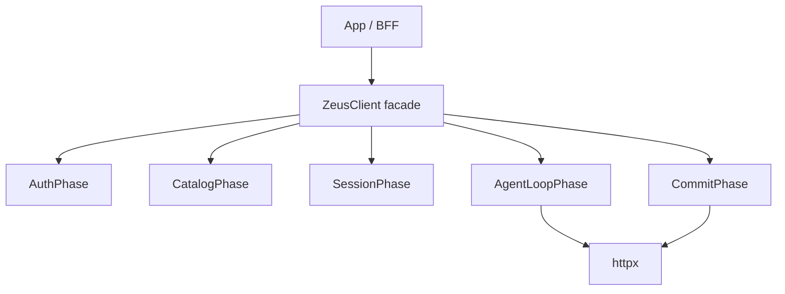
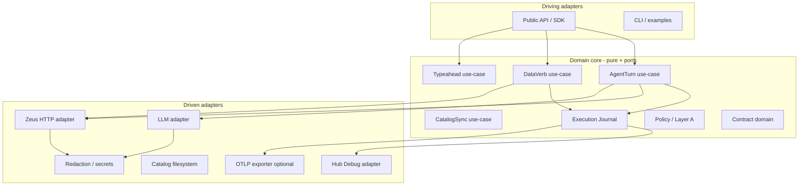
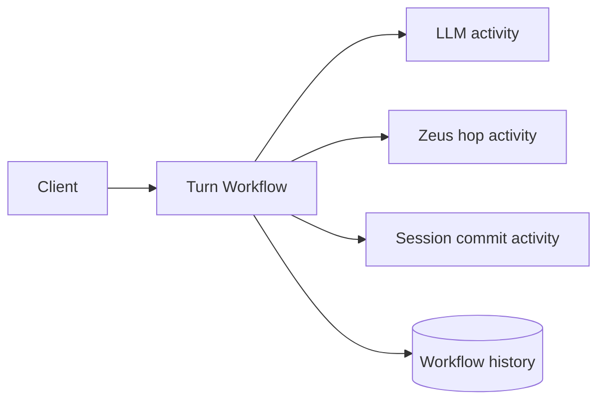
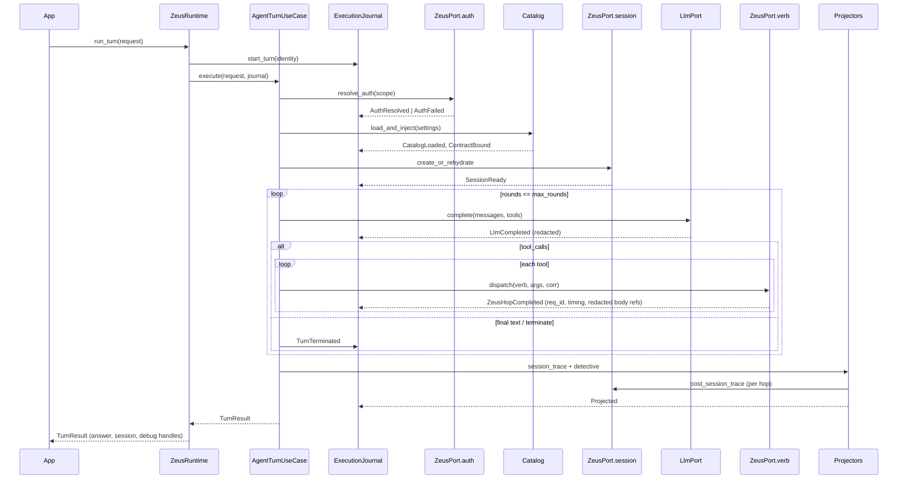
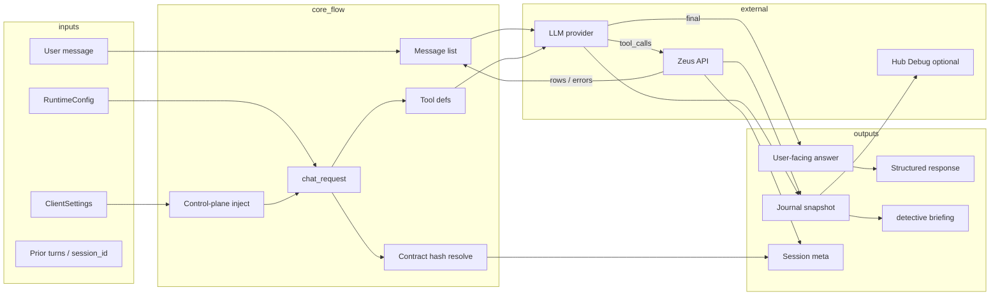
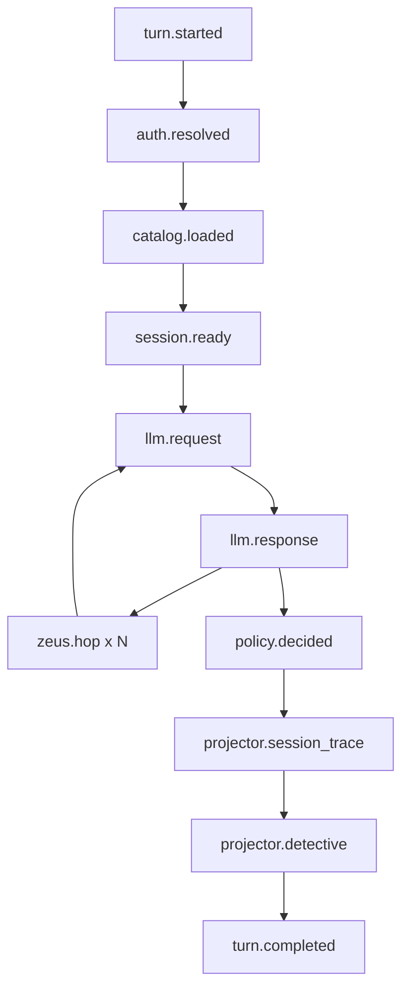
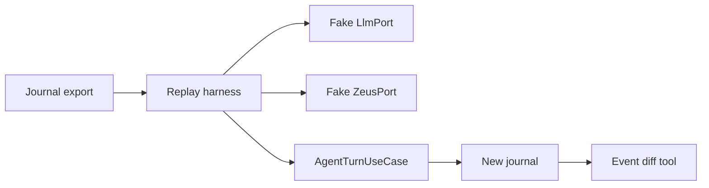

# Zeus Client V2 — Architecture Design

**Status:** Design (not implemented)  
**Audience:** Implementers, integrators, platform engineers  
**Package target:** `kotenai-zeus-client` major version 2  
**Primary mandate:** First-class integration with the Zeus Engine Debug Tool (Detective / session timeline / hop replay)

---

## 0. How this document was produced

Before committing to a design, we:

1. Analyzed the problem Zeus clients must solve (not the existing package layout).
2. Named weaknesses of a *typical* external agent client.
3. Compared three architectures.
4. Selected one and justified the choice.
5. Stress-tested the selection and listed future improvements.

Existing `0.3.x` code is treated as a **field study** (what the world needs), not as a skeleton to extend.

---

## 1. Problem analysis

### 1.1 What a Zeus client is

A Zeus client is **not** a thin OpenAPI wrapper. It is a multi-plane runtime that sits *outside* the Zeus process and must still look “in-process” in the Debug Tool.

Planes:

| Plane | Responsibility |
| --- | --- |
| **Control plane** | Catalogs (`chat_request`), contract hash/stamp, mode, settings, rules, policy |
| **Session plane** | Durable Zeus sessions: create / rehydrate / turn / session-trace |
| **Data plane** | V2 verbs (`find`, `search`, `project`, …), optional pipeline, optional N1QL hydrate |
| **Agent plane** | External LLM loop, tool selection, Layer A / terminate, insight vs cheap path |
| **Observability plane** | Correlation IDs, spans, payloads, Detective briefing, Hub join, replay |

Zeus Engine (server) owns graph storage, search indexes, per-hop debug retention, and Hub Detective. The client owns everything that never hits Zeus as a single in-process ReAct turn — especially the **LLM** and the **multi-hop glue**.

### 1.2 Questions developers must answer

| Question | Requires |
| --- | --- |
| What happened during this request? | Ordered event journal + final summary |
| Which component handled each step? | Component identity on every event |
| What payloads were sent and received? | Redacted request/response captures |
| How long did each operation take? | Monotonic spans with parent/child |
| Where did an error originate? | Error taxonomy + causal chain |
| Can the request be replayed? | Deterministic inputs + recorded decisions |
| Can execution be visualized as a timeline? | Exportable span/event model (OTLP-friendly) |

These are **product requirements**, not nice-to-haves. V2 designs observability as a **spine**, not a bolt-on dict.

### 1.3 Hard environmental constraints (from Zeus Engine)

These are laws of the surrounding system; the client cannot wish them away:

1. **One HTTP hop → one `req_id`.** The client must not invent parent merge ids.
2. **External LLM is off-box.** Tool-hop debug views may omit LLM request tiles for external clients.
3. **Session timeline is one row per conversation round.** Multi-tool turns need client-posted aggregate session-trace bodies joined on each hop’s `req_id`.
4. **Some multi-step hops are thinner in debug** than single-verb hops — prefer tool `req_id`s and session join.
5. **Contract hashes are Hub-stamped.** Clients must never invent production stamps.
6. **Three clocks must never conflate:** Zeus engine semver, chat_request `base-N`, client package semver.

V2 must **cooperate** with these constraints and make the external multi-hop story as operable as in-process Hub chat.

### 1.4 Stakeholder goals

| Stakeholder | Goal |
| --- | --- |
| App / BFF engineer | One clear API: agent turn, typeahead, direct verb; predictable types |
| Platform / SRE | Safe defaults, redaction, rate limits, no secret leakage |
| Support / Detective user | Session deep-link, preferred hop, payload + timeline, support pack |
| Library maintainer | Testable pure core, swappable transports, no god-modules |
| Future SDK ports (TS, Go) | Protocol + journal schema portable; Python is first implementation |

---

## 2. Weaknesses of a typical client architecture

These failure modes appear in most “agent + tools” clients (and in field use of Zeus-style stacks):

| Weakness | Symptom | Cost |
| --- | --- | --- |
| **God orchestrator** | One 500–1000 LOC function with 15+ positional args | Untestable, unreadable, high regression risk |
| **Ad-hoc trace dict** | `trace["notes"].append(...)` scattered everywhere | No schema, no timeline, no replay, race-prone mutation |
| **Observability afterthought** | Debug built after happy path | Missing IDs, thin Detective, “works in Hub, broken in client” |
| **Inconsistent planes** | Agent path stamps headers; verb helpers don’t (or reverse) | Partial Hub join, operator confusion |
| **Global singleton HTTP** | Process-wide client, hidden lifecycle | Hard in tests, multi-tenant, and shutdown |
| **Tuple / dict soup returns** | `(answer, trace, turns, session_meta)` | Breaking changes, poor IDE UX, no versioned envelope |
| **Hooks as only extension** | Inheritance or monkeypatch for behavior | Fragile; no capability discovery |
| **Secrets in logs** | Auth headers / bodies dumped on error | Security incidents |
| **No error taxonomy** | Strings and status codes only | Cannot auto-diagnose or retry correctly |
| **No replay** | Cannot re-run a turn against recorded LLM/tool responses | Slow support loops |
| **Catalog path magic** | Silent cross-scope file fallback | Wrong contract with green audits |
| **Dual naming eras** | V1 tools + V2 verbs + product nicknames | Integrator cognitive load |
| **Policy / G2 leakage** | Jailbreak scores or Layer A dumps in user chat | Product/compliance failure |
| **Retry without classification** | Blind retries on 4xx contract errors | Amplifies load, hides root cause |

V2 is designed to eliminate this class of defects by construction.

---

## 3. Architecture candidates

### 3.1 Candidate A — Improved monolithic facade + phase pipeline

**Shape:** Single `ZeusClient` class; internal ordered phases (`Auth` → `Catalog` → `Session` → `Loop` → `Commit`). Shared `TurnContext` mutable bag. Trace remains a structured dict built by helpers.



| Pros | Cons |
| --- | --- |
| Familiar; fastest path from 0.3.x mental model | Still central orchestration gravity well |
| Easy to ship incremental features | Mutable context becomes the new god object |
| Low abstraction tax | Replay/debug still second-class unless carefully added |
| | Harder multi-language protocol freeze |

**Verdict:** Good for a 0.4 cleanup. **Insufficient** for “debug is the product.”

---

### 3.2 Candidate B — Hexagonal core + immutable Execution Journal (selected)

**Shape:** Domain core with ports (interfaces). Adapters for HTTP Zeus, LLM providers, clock, ID generation, secret store, Hub debug API. Every side effect emits an **immutable event** into an **Execution Journal**. Agent, Data, and Catalog are **use-cases** composed over the same ports. Debug/Detective is a **projector** over the journal (+ optional Hub hydrate).



| Pros | Cons |
| --- | --- |
| Debug spine is structural | More types/files upfront |
| Pure core unit-tests without network | Requires discipline not to leak HTTP into domain |
| Planes share correlation + redaction | Slightly steeper onboarding |
| Replay becomes natural (journal + fakes) | |
| Portable journal schema for TS/Go later | |
| Composability over inheritance | |

**Verdict:** **Selected.** Best balance of observability, maintainability, and long-term multi-SDK discipline without building a distributed workflow engine.

---

### 3.3 Candidate C — Workflow / actor engine (Temporal-style)

**Shape:** Each turn is a durable workflow; activities for LLM, each Zeus hop, session commit. Full history store; workers; signals for cancel.



| Pros | Cons |
| --- | --- |
| Industrial-grade durability & replay | Massive complexity for a library |
| Built-in timelines | Forces infra dependency or embeds a mini-engine |
| | Poor fit for “pip install client” DX |
| | Duplicates Zeus session durability |

**Verdict:** Rejected for the **library**. Patterns (activities, heartbeats, cancel tokens) are **borrowed** into Candidate B without the engine.

---

### 3.4 Comparison matrix

| Criterion (weight) | A Monolith+phases | B Hex + Journal | C Workflow engine |
| --- | --- | --- | --- |
| Observability / Detective (25) | 6 | **9** | 9 |
| Debuggability / replay (15) | 5 | **9** | 10 |
| DX as a library (15) | 8 | **8** | 3 |
| Extensibility (10) | 5 | **9** | 7 |
| Security by default (10) | 5 | **9** | 8 |
| Performance (overhead) (10) | **9** | 8 | 5 |
| Maintainability (10) | 5 | **9** | 6 |
| Implementation cost (5) | **9** | 6 | 2 |
| **Weighted ~** | **6.4** | **8.6** | **6.5** |

---

## 4. Selected architecture (detail)

### 4.1 System overview

**Name:** Zeus Client V2 — **Journaled Hexagonal Runtime**

Principles:

1. **Journal-first:** If it isn’t in the journal (or a deliberate redaction tombstone), it didn’t happen for operators.
2. **Ports over frameworks:** Domain never imports `httpx` or provider SDKs.
3. **One runtime, many use-cases:** Agent, verb, typeahead, catalog sync share identity, auth, transport, redaction, metrics.
4. **Typed results:** No naked tuples at the public boundary.
5. **Debug is a projector:** Detective briefing, OTLP, and Hub session-trace posts are **views** of the journal, not parallel ad-hoc structures.
6. **Safe by default:** Redaction on, force-trace off in prod profiles, secrets never in journal bodies.
7. **Composability:** Plugins register middleware/interceptors; avoid subclassing the client.
8. **Honest multi-hop model:** Do not pretend one `req_id` holds the whole external turn; present **session + hop set** as the unit of debug.

### 4.2 Component responsibilities

| Component | Layer | Responsibility | Non-responsibility |
| --- | --- | --- | --- |
| **Public SDK** (`ZeusRuntime`, facades) | Driving | Lifecycle, config bind, ergonomic APIs | Business rules |
| **Use-cases** | Application | Orchestrate a turn/verb/sync | Wire formats of providers |
| **Domain models** | Domain | Contract, catalog, Layer A, policy, errors | I/O |
| **Execution Journal** | Domain/app | Append-only events, span tree, export | Network |
| **Identity / Correlation** | Domain | `turn_id`, `chat_id`, hop ids, clock | Persistence |
| **ZeusPort** | Port | Session, verbs, auth mint, catalog fetch | Retries policy details may sit in adapter |
| **LlmPort** | Port | Chat completions + tool calls | Prompt policy |
| **HubDebugPort** | Port | Optional `GET debug/req|session` | Diagnosis pure logic |
| **CatalogStorePort** | Port | Load/save stamped catalogs | Hash algorithms (domain) |
| **SecretStorePort** | Port | Resolve credentials | Logging |
| **Redactor** | Domain/app | Mask headers/bodies for journal & logs | Crypto KMS |
| **DetectiveProjector** | Application | Overview / Diagnosis / Prompt from journal | Hub HTML |
| **SessionTraceProjector** | Application | Build multi-hop POST bodies for Zeus | Zeus TraceDoc storage |
| **Plugin registry** | Application | Middleware chain | Core protocol |
| **HTTP adapters** | Infrastructure | httpx, timeouts, connection pool | Domain decisions |
| **OTLP exporter** | Infrastructure | Optional telemetry sink | Required for correctness |

### 4.3 Logical package map (target)

```text
zeus_client/                 # public package root (v2)
  __init__.py                # stable exports only
  runtime.py                 # ZeusRuntime lifecycle
  api/                       # thin typed facades
    agent.py                 # run_turn / AgentApi
    data.py                  # run_verb / run_search
    catalog.py               # sync / load
    debug.py                 # export journal, detective, replay
  domain/
    ids.py
    errors.py
    contract.py
    catalog.py
    layer_a.py
    policy.py
    messages.py
    journal/
      events.py              # event types (frozen)
      journal.py             # append-only store
      spans.py
      export.py              # JSON / OTLP mapping
  application/
    agent_turn.py
    data_verb.py
    typeahead.py
    catalog_sync.py
    session_lifecycle.py
    detective/
      build.py
      playbooks.py
    projectors/
      session_trace.py
      public_trace.py        # backward-friendly trace dict if needed
    middleware.py
    plugins.py
  ports/
    zeus.py
    llm.py
    hub_debug.py
    catalog_store.py
    secrets.py
    clock.py
    id_factory.py
    http.py
  adapters/
    zeus_http/
    llm_openai_compatible/
    hub_debug_http/
    catalog_fs/
    secrets_env/
    otlp/
  config/
    models.py                # pydantic or attrs settings
    loader.py
    profiles.py              # dev / prod / ci
  security/
    redact.py
    validate.py
  compat/                    # optional v1 shims (time-boxed)
```

### 4.4 Request lifecycle (agent turn)



### 4.5 Data flow



**Payload handling rule:** Full bodies live behind **content-addressed blobs** in the journal (`payload_ref` → redacted snapshot). Hot path events store hashes, sizes, content-types, and short previews only. This keeps memory bounded while preserving debuggability.

### 4.6 Event flow (journal)

Events are **immutable**, **ordered**, and **typed**. Illustrative taxonomy:

| Event | When | Key fields |
| --- | --- | --- |
| `turn.started` | Use-case entry | `turn_id`, `chat_id`, `mode`, `target`, `client_version`, `base_id?` |
| `auth.resolved` | After mint/cache | `auth_mode`, `latency_ms`, `scope` (no secrets) |
| `catalog.loaded` | Path + stamp | `source`, `path_fingerprint`, `stamped_hash`, `content_hash`, flags |
| `contract.bound` | Session bind choice | `contract_id`, `hash_source` (payload\|stamp\|bound) |
| `session.ready` | Create/rehydrate | `session_id`, `round`, `contract_status` |
| `span.started` / `span.ended` | Any timed unit | `span_id`, `parent_id`, `name`, `component` |
| `llm.request` / `llm.response` | Each completion | model, tokens, tool_call count, `payload_ref` |
| `zeus.hop` | Each HTTP tool/verb | method, path, status, `req_id`, ms, bytes, `payload_ref`s |
| `policy.decided` | Layer A / policy table | action, grades (G2 stays out of answer) |
| `error.raised` | Any failure | `ErrorCode`, retryable, cause_event_id |
| `projector.session_trace` | After post | hop ids, primary_req_id, statuses |
| `projector.detective` | After build | verdicts, playbook ids |
| `turn.completed` | Exit | status, total_ms, answer_digest |



**Subscribers (in-process):**

- SessionTraceProjector  
- DetectiveProjector  
- StructuredLogBridge  
- OtlpExporter (optional)  
- Plugin middleware (read-only or annotated)

### 4.7 State management

| State kind | Ownership | Mutability | Lifetime |
| --- | --- | --- | --- |
| Runtime config | `ZeusRuntime` | Immutable after bind | Process / context manager |
| HTTP pool | Transport adapter | Internal | Runtime lifetime |
| Auth session cache | Auth adapter | Mutable, scoped, TTL | Runtime |
| Catalog disk cache | CatalogStore | Files + manifest | User config dir |
| Turn journal | Per turn | Append-only | Turn (+ export) |
| Message list | Agent use-case | Turn-local copy | Turn |
| Durable Zeus session | Server | Server CAS | Multi-turn |
| Plugin registrations | Runtime | At bind time | Runtime |

**Rule:** No global mutable module state for HTTP or auth in V2. Tests inject fakes via ports.

**Session continuity:** Callers pass `SessionHandle(session_id, round, chat_id)` from prior `TurnResult.session`. Runtime never silently reuses another chat’s durable session (anti-bleed).

### 4.8 Debug architecture (first-class)

#### 4.8.1 Debug unit of analysis

| Unit | ID | Use |
| --- | --- | --- |
| **Turn** | `turn_id` (client ULID/UUIDv7) | Local journal root |
| **Chat** | `chat_id` | Product conversation; correlation header |
| **Zeus session** | `session_id` | Hub session debug entry (URL from `debug.hub.session_url`) |
| **Hop** | `req_id` (server) | Hub hop debug entry (URL from `debug.hub.preferred_req_url`) |
| **Span** | `span_id` | Timeline visualization |

Primary operator entry for external clients: **session page**, then drill hops. Client always returns:

```text
debug.hub.session_url
debug.hub.preferred_req_url
debug.journal_id / export handle
debug.detective (Overview · Diagnosis · Prompt)
```

#### 4.8.2 Correlation headers (every Zeus hop)

| Header | Required | Notes |
| --- | --- | --- |
| `X-Zeus-Chat-Id` | yes (when known) | Product chat |
| `X-Zeus-Turn-Id` | yes | Client turn |
| `X-Zeus-Call-Id` | yes per hop | Client hop id (≠ req_id) |
| `X-Zeus-Mode` | yes | analytics / … |
| `X-Zeus-Scope` | yes when path-scoped | `bucket/scope` |
| `X-Zeus-Trace` | optional | `1` force keep |
| `X-Zeus-Req-Id` | **never reuse across hops** | Only if replaying a single hop deliberately |

#### 4.8.3 Session-trace strategy (multi-hop)

Preserve the proven join technique, but drive it from the journal:

1. Collect all successful/failed tool hops with `req_id`.
2. Rank **primary** hop: error → rows → find/search → non-pipeline.
3. Build **one** aggregate payload (`tool_hops[]`, `primary_req_id`, rich snippets).
4. POST identical body to `/v2/session/trace` for **each** hop `req_id`, **primary last**.
5. Record projector outcomes in the journal.

#### 4.8.4 Detective projector

Pure function over journal (+ optional Hub snapshots):

- **Overview:** wall/ai/zeus ms, tokens, rounds, hop table, hub links, catalog flags, Layer A summary  
- **Prompt:** client-true inject checklist from catalog/system message (authoritative externally)  
- **Diagnosis:** grades + small playbook set; Hub hydrate additive, never clobber client inject **pass** with tool-hop **fail** without conflict note  

G2 / scores / wish_i_knew → artifacts only, never user-facing answer.

#### 4.8.5 Timeline visualization

Export:

1. **Journal JSON** (canonical)  
2. **Span tree JSON** (UI-friendly)  
3. **OTLP traces** (optional)  
4. **Mermaid Gantt/sequence** generator (devtools helper, not runtime dependency)

Chat-trace widgets consume `TurnResult.debug` / public trace projection — they do not scrape Hub HTML.

#### 4.8.6 Replay

Two modes:

| Mode | Behavior |
| --- | --- |
| **Transport replay** | Recorded LLM + Zeus payloads replayed via fake ports; pure determinism for tests/support |
| **Live re-exec** | Same inputs, live network; new ids; linked as `replay_of=turn_id` |

Replay packages are **redacted by default** and gated by security policy (see SECURITY.md).



### 4.9 Logging strategy

| Channel | Audience | Content |
| --- | --- | --- |
| **Journal** | Operators / support | Structured truth (redacted) |
| **Application logs** | SRE | `event_id`, codes, latencies — not full prompts by default |
| **Metrics** | SRE | counters/histograms: turns, hops, errors by `ErrorCode`, token usage |
| **Hub Detective** | Humans | Session + hop pages via Zeus sinks |

Levels:

- `DEBUG` — adapter chatter (disabled in prod profile default)  
- `INFO` — turn start/end, session create, primary req_id  
- `WARNING` — recoverable (rehydrate fail → recreate, soft projector fail)  
- `ERROR` — turn failure with `ErrorCode`  

**Never** log raw `Authorization`, passwords, API keys, or unredacted PII payloads at any level in production profile.

### 4.10 Error handling strategy

Typed error model:

```text
ZeusClientError
├── ConfigError          # invalid settings, missing sample
├── AuthError            # 401/403/lockout/session_unavailable
├── ContractError        # drift, mismatch 409, stamp issues
├── CatalogError         # load/sync/path
├── SessionError         # create/rehydrate/turn CAS
├── ZeusTransportError   # network/timeouts
├── ZeusToolError        # hop 4xx/5xx with body classification
├── LlmError             # provider failures
├── PolicyError          # forced refuse paths (may be “successful” turn)
├── ValidationError      # input schema
└── InternalError        # bug; include journal ref
```

Each error carries:

- `code: ErrorCode` (stable string enum)
- `retryable: bool`
- `component: str`
- `cause_event_id: str | None`
- `public_message: str` (safe)
- `details: dict` (redacted)

**Classification examples:**

| Signal | Code | Retryable |
| --- | --- | --- |
| `unknown boundary: "collections"` | `ZEUS_BOUNDARY_MISCONFIG` | no |
| `search_timeout` | `ZEUS_FTS_TIMEOUT` | maybe (budget) |
| `strategy=fts does not accept where` | `ZEUS_TOOL_CONTRACT` | no |
| `session_unavailable` / cluster closed | `ZEUS_AUTH_SESSION_UNAVAILABLE` | after backoff / ops |
| `contract_mismatch` 409 | `ZEUS_CONTRACT_MISMATCH` | no (fix bind) |
| LLM 429 | `LLM_RATE_LIMIT` | yes |
| DNS / connect | `TRANSPORT_CONNECT` | yes |

Projectors map codes → Detective playbooks.

### 4.11 Retry strategy

Retries live in **adapters** behind a shared `RetryPolicy`:

| Class | Policy |
| --- | --- |
| Idempotent GET / auth mint (carefully) | Exponential backoff + jitter; cap 3 |
| Zeus tool POST | **Default no retry** (non-idempotent risk); allowlist verbs + explicit `Idempotency-Key` if Zeus supports |
| LLM 429/503 | Backoff; respect `Retry-After` |
| Contract / validation / 4xx tool contract | **Never** retry |
| Session turn 409 round conflict | Rehydrate once, then fail |
| Projector / Detective | Soft-fail; never fail the turn |

Budget: `RetryBudget` per turn (max extra ms + max attempts) so retries cannot dominate SLA.

### 4.12 Configuration system

```mermaid
flowchart TB
  Def[Code defaults] --> Merge
  File[config.toml/json] --> Merge
  Env[Env vars ZEUS_CLIENT_*] --> Merge
  Prog[Programmatic overrides] --> Merge
  Merge --> Val[Validate]
  Val --> Prof[Apply profile dev|prod|ci]
  Prof --> RT[Immutable RuntimeConfig]
```

Design choices:

- **Single immutable `RuntimeConfig`** after load (attrs/pydantic).
- **Profiles:** `development` (verbose journal, force_trace optional), `production` (redaction strict, minimal logs), `ci` (fake clocks, deterministic ids).
- **Separate secret material** from config snapshots used in journals (config export redacts).
- **Target binding:** `DataTarget(bucket, scope, collection, mode)` explicit on calls; config supplies defaults only.
- **No silent cross-scope catalog rglob.** Resolution order: scope dir → non-scope general files → bundled. Missing file errors loudly.

### 4.13 Extension / plugin architecture

Prefer **middleware and capability registration** over subclassing.

```python
class Plugin(Protocol):
    name: str
    def register(self, registry: PluginRegistry) -> None: ...

# Middleware hooks (async):
# before_turn / after_turn
# before_llm / after_llm
# before_zeus_hop / after_zeus_hop
# on_event (journal subscriber, read-only)
```

Use cases:

- Custom auth header injection  
- Enterprise redaction rules  
- Extra metrics backend  
- Guardrails beyond default policy  
- Recording exporter to S3  

Plugins **must not** break journal integrity (cannot rewrite past events; may append annotations).

### 4.14 Public API shape (illustrative)

```python
async with ZeusRuntime.from_config() as rt:
    result = await rt.agent.run_turn(
        "How many breweries?",
        target=DataTarget(bucket="...", scope="_default", collection="_default", mode="analytics"),
        settings=ClientSettings(ai_process_result=True),
        session=prior_handle,  # optional
    )
    print(result.answer)
    print(result.debug.hub.session_url)
    print(result.debug.detective.diagnosis.headline)

    hits = await rt.data.search("sushi", target=..., options=SearchOptions(limit=8))
    found = await rt.data.verb("find", {"entity_type": "Business", "where": {...}}, target=...)
```

`TurnResult` (conceptual):

| Field | Type | Notes |
| --- | --- | --- |
| `answer` | `str` | User-facing only (Layer A peeled) |
| `structured` | `StructuredResult \| None` | rows, layer_a, policy ui |
| `session` | `SessionHandle` | for multi-turn |
| `debug` | `DebugBundle` | detective, links, journal export ref |
| `status` | `TurnStatus` | ok / refused / error |
| `error` | `ErrorInfo \| None` | typed |

### 4.15 Performance considerations

- Shared HTTP connection pool per runtime  
- Journal: ring buffer of events + off-hot-path payload store; configurable max payload bytes  
- Avoid deep `deepcopy` of catalogs every turn; copy-on-write or structural sharing after freeze  
- Typeahead path **never** enters agent use-case  
- Parallel hops only when the model requested parallel tool_calls **and** tools are side-effect free (default sequential for safety)  
- Detective projector O(n) in events; cap playbook evaluation  
- Optional lazy Hub hydrate with tight timeout  

### 4.16 Security (summary)

See [SECURITY.md](./SECURITY.md). Design hooks:

- Redactor at journal append boundary  
- SecretStore never returns values into events  
- Replay packages signed/encrypted optional  
- Debug export requires explicit `DebugExportPolicy`  

### 4.17 Tradeoffs and architectural decisions

| Decision | Choice | Why | Alternative rejected |
| --- | --- | --- | --- |
| Core style | Hexagonal + journal | Testability + debug spine | Monolith phases |
| Trace model | Event journal + projectors | Single source of truth | Parallel trace dict + logs |
| Public API | Runtime + namespaced facades | Discoverability | 40 free functions |
| Returns | Typed result objects | DX + evolution | Tuples |
| HTTP | Injected port, no process global | Tests/multi-tenant | Module singleton |
| Catalog resolve | Fail closed on path | Correctness | Silent rglob sibling scopes |
| pipeline public helper | Still **not** exposed as `run_pipeline` | Avoid ungoverned multi-step from BFFs | Open pipeline |
| Detective | Client projector default on | External SoT for prompt | Hub scrape only |
| G2 in chat | Forbidden | Product safety | Dump scores in answer |
| Retries on tools | Off by default | Safety | Blind retry |
| Workflow engine | No | Library DX | Temporal embed |
| Schema validation | Domain validators (+ optional pydantic) | Fewer hard deps if needed | Mandatory heavy framework |
| V1 tools | Compat adapter time-boxed | Force V2 verbs | Eternal dual stack |

### 4.18 Future scalability

| Horizon | Capability |
| --- | --- |
| Near | OTLP export; journal diff CLI; richer playbooks |
| Mid | TypeScript journal schema mirror; shared JSON Schema for events |
| Mid | Streaming agent tokens with span events |
| Mid | Parallel hop scheduler with dependency graph from pipeline plans |
| Long | Optional remote journal sink (privacy-preserving support) |
| Long | Policy-as-WASM or CEL for enterprise rules without forking |
| Long | If Zeus adds parent `trace_id`, journal maps 1:1 without aggregate POSTs |

### 4.19 Challenging this design — residual risks & improvements

| Risk | Mitigation / future |
| --- | --- |
| Journal memory growth | Payload refs + size caps + sampling policy |
| Over-abstraction slows contributors | Keep adapters thin; “one obvious place” docs; golden paths |
| Projector drift from Hub Diagnosis | Version playbooks; golden fixtures from lab traces |
| Zeus server instrumentation gaps remain | Document honestly; deep-link storage spans; track Zeus roadmap |
| Replay fidelity with non-deterministic LLM | Record mode only guarantees transport replay |
| Plugin middleware ordering bugs | Explicit priority bands; integration tests |
| Typed API churn at 2.0 | Freeze public models with JSON Schema; compat shim ≤1 minor |

**Future improvement candidates (post-2.0):**

1. Server-side multi-hop debug merge (eliminates identical multi-POST join).  
2. Client-side OpenTelemetry context propagation as default.  
3. Declarative agent graphs (plan → execute) for constrained enterprise modes.  
4. Built-in **compare two turns** diff in `api.debug`.  
5. Capability negotiation with Zeus (`/describe`) cached per scope.

---

## 5. Mapping developer questions → design

| Question | Answer path in V2 |
| --- | --- |
| What happened? | `TurnResult.debug.journal` / export |
| Which component? | `event.component` + span names |
| Payloads? | `payload_ref` → redacted snapshots |
| Duration? | span tree + hop `ms` |
| Error origin? | `error.raised` + `cause_event_id` + `ErrorCode` |
| Replay? | `api.debug.replay(journal)` |
| Timeline? | span export / Mermaid / OTLP / Hub session |

---

## 6. Non-goals (V2)

- Replacing Hub HTML Detective or Storage SQL browser  
- Embedding a full workflow engine  
- Inventing contract stamps  
- Making external tool hops look like Hub in-process AI prompts without server changes  
- Guaranteeing bit-identical live re-exec of non-deterministic models  
- Supporting unbounded silent legacy catalog quirks  

---

## 7. Relationship to V1 (0.3.x)

V1 remains valuable as a **behavioral oracle** for:

- Contract hash stability rules  
- Session-trace multi-hop join  
- `ai_process_result` cheap vs insight  
- Layer A peel  
- Verb vs search naming  

V2 re-implements these as **use-cases and projectors**, not as a refactor of `loop.py`.

Migration is covered in [IMPLEMENTATION_GUIDE.md](./IMPLEMENTATION_GUIDE.md).

---

## 8. Document index

| Doc | Contents |
| --- | --- |
| [DESIGN.md](./DESIGN.md) | This file |
| [IMPLEMENTATION_GUIDE.md](./IMPLEMENTATION_GUIDE.md) | Phased build plan |
| [SECURITY.md](./SECURITY.md) | Threat model and controls |
| [BEST_PRACTICES.md](./BEST_PRACTICES.md) | Engineering standards |

---

## 9. Summary

Zeus Client V2 is a **journaled hexagonal runtime**: one observability spine, multiple use-cases, typed results, safe defaults, and honest multi-hop Debug Tool integration. It optimizes for the operator questions that define trust in an external agent stack — without pretending the client is a thin HTTP wrapper or a distributed workflow platform.
