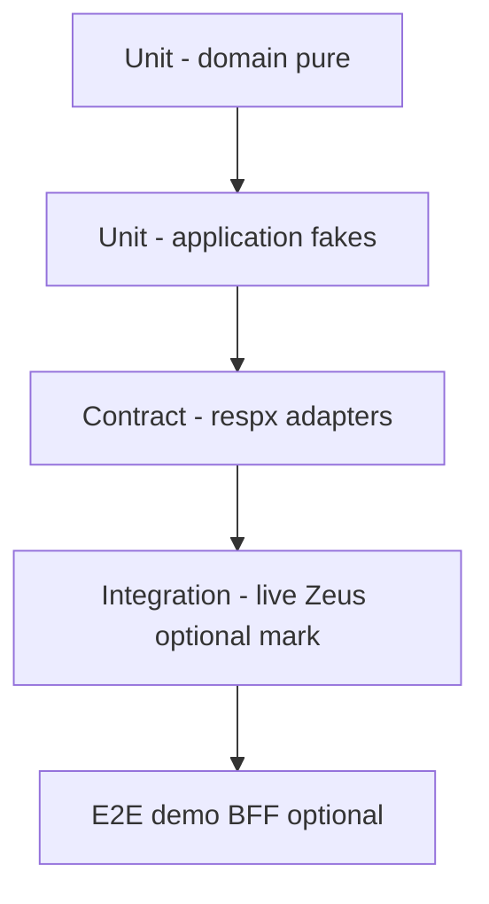

# Zeus Client V2 — Implementation Guide

**Companion to:** [DESIGN.md](./DESIGN.md)  
**Goal:** An engineer can implement V2 without further design decisions.  
**Style:** Phased, test-first, shippable increments.

---

## 0. Ground rules for implementers

1. **Design doc wins** on architecture disputes; this guide wins on sequencing and file layout.
2. **TDD for domain and projectors** — pure tests first; adapters get contract tests with `respx`/fakes.
3. **No process-global HTTP or auth** in V2 code paths.
4. **Do not invent contract stamps** — tests use fixtures; integration uses Hub-stamped catalogs.
5. **Every Zeus hop** emits journal events + correlation headers.
6. **Detective/session-trace projectors never raise out of a successful domain turn** — soft-fail + note.
7. **Public API is typed** — no new tuple returns.
8. **V1 compat is optional and time-boxed** — see Phase 8.
9. Prefer **composition**; no plugin base-class inheritance trees.
10. Keep **payload bodies** out of hot event structs — use `payload_ref`.

### Tooling baseline

| Tool | Purpose |
| --- | --- |
| Python ≥ 3.11 | Runtime |
| `pytest` + `pytest-asyncio` | Tests |
| `respx` | HTTP mocking |
| `httpx` | Default Zeus/LLM transport |
| `ruff` | Lint/format (recommended) |
| `mypy` or `pyright` | Type check public + domain |
| optional `pydantic` v2 | Config validation (allowed; keep domain free of it if possible) |

### Versioning during build

| Stage | Version |
| --- | --- |
| Internal spikes | `2.0.0a1` … |
| Feature-complete beta | `2.0.0b1` |
| GA | `2.0.0` |

Keep `pyproject.toml` and `zeus_client.__version__` identical every release.

---

## Phase 0 — Repository skeleton and quality gates

### Objectives

- Create V2 package layout without deleting V1 yet (side-by-side or `src/zeus_client_v2` → merge at Phase 8).
- CI runs lint + typecheck + unit tests on empty/skeleton.
- Establish coding/test conventions from [BEST_PRACTICES.md](./BEST_PRACTICES.md).

### Recommended layout strategy

**Preferred:** develop under `src/zeus_client/` on branch `feat/v2` with V1 moved to `src/zeus_client/v1_legacy/` only when cutover starts — **or** greenfield package path:

```text
src/zeus_client/           # becomes V2
# temporarily keep critical V1 modules importable via zeus_client.compat.v1
```

Decision locked for implementers: **greenfield modules in the tree from DESIGN §4.3**; do not “fix in place” `loop.py`. Port behavior via tests that encode V1 oracles.

### Folder structure (create empty modules)

```text
src/zeus_client/
  __init__.py
  py.typed
  runtime.py
  api/{__init__,agent,data,catalog,debug,jobs,units}.py
  domain/{ids,errors,contract,catalog,layer_a,policy,messages,jobs,llm_roles}.py
  domain/journal/{__init__,events,journal,spans,export,payload_store}.py
  application/{agent_turn,data_verb,typeahead,catalog_sync,session_lifecycle,middleware,plugins,units_agent,units_direct}.py
  application/detective/{__init__,build,overview,prompt_checklist,diagnosis,playbooks,support_pack,extract,hub_hydrate}.py
  application/projectors/{__init__,session_trace,public_trace}.py
  ports/{zeus,llm,hub_debug,catalog_store,secrets,clock,id_factory,http,jobs}.py
  adapters/zeus_http/{__init__,auth,session,verbs,catalog_remote,headers}.py
  adapters/llm_openai_compatible/{__init__,client}.py
  adapters/hub_debug_http/{__init__,client}.py
  adapters/catalog_fs/{__init__,store}.py
  adapters/secrets_env/{__init__,store}.py
  adapters/otlp/{__init__,exporter}.py
  adapters/jobs_http/{__init__,client,paths,sse}.py
  adapters/jobs_fake/{__init__,runtime}.py
  config/{models,loader,profiles}.py
  security/{redact,validate}.py
  compat/__init__.py
tests/
  unit/domain/...
  unit/application/...
  contract/adapters/...
  integration/...
  fixtures/...
docs/V2/   # this documentation
```

### Interfaces (Phase 0)

```python
# ports/clock.py
class Clock(Protocol):
    def now_ms(self) -> int: ...
    def monotonic_ms(self) -> int: ...

# ports/id_factory.py
class IdFactory(Protocol):
    def turn_id(self) -> str: ...
    def chat_id(self) -> str: ...
    def call_id(self) -> str: ...
    def span_id(self) -> str: ...
```

### Public APIs

- None yet beyond `__version__ = "2.0.0a0"`.

### Milestones

- [ ] Package imports
- [ ] `pytest -q` green (smoke)
- [ ] CI workflow skeleton
- [ ] `py.typed` present

### Testing strategy

- `tests/unit/test_smoke_import_v2.py`

### Migration strategy

- N/A (docs only consumers).

### Risks

| Risk | Mitigation |
| --- | --- |
| Dual-tree confusion | Single README badge “V2 in progress”; changelog |
| Over-scaffolding | Only create packages that Phase 1+ fill immediately |

---

## Phase 1 — Domain foundation: IDs, errors, journal, redaction

### Objectives

- Immutable event model + append-only journal + payload store.
- Error taxonomy with `ErrorCode`, retryable flags.
- Redactor that secrets never enter journal bodies.
- Span start/end helpers.

### Required modules

- `domain/ids.py` — `TurnId`, `ChatId`, `CallId`, `SessionId`, `ReqId` newtypes/str wrappers
- `domain/errors.py` — exception hierarchy + `ErrorCode` enum
- `domain/journal/events.py` — frozen dataclasses / pydantic v1-style frozen models
- `domain/journal/journal.py` — `ExecutionJournal`
- `domain/journal/spans.py` — `SpanTracer`
- `domain/journal/payload_store.py` — content-addressed blobs
- `domain/journal/export.py` — JSON export
- `security/redact.py` — header/body masking
- `adapters` fakes for clock/id in tests

### Interfaces

```python
@dataclass(frozen=True, slots=True)
class JournalEvent:
    event_id: str
    ts_ms: int
    type: str                 # e.g. "zeus.hop"
    component: str            # e.g. "adapters.zeus_http.verbs"
    turn_id: str
    span_id: str | None
    parent_span_id: str | None
    data: Mapping[str, Any]   # already redacted, JSON-serializable
    payload_refs: tuple[str, ...] = ()

class ExecutionJournal(Protocol):
    def append(self, event: JournalEvent) -> None: ...
    def events(self) -> Sequence[JournalEvent]: ...
    def get_payload(self, ref: str) -> bytes | None: ...
    def export(self) -> JournalExport: ...

class PayloadStore(Protocol):
    def put(self, data: bytes, *, content_type: str, kind: str) -> str: ...
    def get(self, ref: str) -> bytes | None: ...

class Redactor(Protocol):
    def headers(self, h: Mapping[str, str]) -> dict[str, str]: ...
    def json_value(self, v: Any, *, path: str = "$") -> Any: ...
    def text(self, s: str, *, max_chars: int) -> str: ...
```

### Event type registry (implement all stubs; fill data gradually)

See DESIGN §4.6. Minimum for Phase 1 tests:

- `turn.started`, `turn.completed`
- `span.started`, `span.ended`
- `error.raised`
- `note` (free-form structured note)

### Folder structure

As DESIGN §4.3 `domain/journal/*`, `security/redact.py`.

### Public APIs

```python
from zeus_client.domain.journal import ExecutionJournal, InMemoryJournal
from zeus_client.domain.errors import ErrorCode, ZeusClientError
```

(Internal until runtime lands; may stay non-exported.)

### Internal APIs

- `InMemoryJournal`, `InMemoryPayloadStore`
- `default_redactor(policy: RedactionPolicy)`

### Milestones

- [ ] Journal append order preserved
- [ ] Redactor masks `Authorization`, `password`, `api_key`, bearer tokens
- [ ] Payload store SHA-256 ref
- [ ] Export round-trip JSON
- [ ] Span parent linkage

### Testing strategy

| Test | Asserts |
| --- | --- |
| `test_journal_append_order` | order + immutability |
| `test_redact_headers` | auth gone |
| `test_redact_json_nested` | deep keys |
| `test_payload_ref_dedup` | same bytes → same ref |
| `test_export_schema_v1` | JSON Schema snapshot |

### Migration strategy

- None.

### Risks

| Risk | Mitigation |
| --- | --- |
| Event schema churn | Version `journal_schema: 1` in export; additive fields only |
| Over-redaction breaks debug | Preview windows + hashed fingerprints |

---

## Phase 2 — Config, runtime lifecycle, ports wiring

### Objectives

- Immutable `RuntimeConfig` + profiles.
- `ZeusRuntime` async context manager wires adapters.
- Secret store from env/config without leaking into exports.

### Required modules

- `config/models.py` — `RuntimeConfig`, `ZeusEndpointConfig`, `LlmProviderConfig`, `DataTarget`, `ClientSettings`, `RetryPolicy`, `RedactionPolicy`, `DebugPolicy`
- `config/loader.py` — file + env merge
- `config/profiles.py` — dev/prod/ci
- `runtime.py` — construction
- `ports/*.py` — full Protocol definitions
- `adapters/secrets_env/store.py`
- default no-op OTLP

### Interfaces

```python
class ZeusPort(Protocol):
    async def resolve_auth(self, target: DataTarget, *, force: bool = False) -> AuthContext: ...
    async def create_session(self, req: CreateSessionRequest) -> SessionCreateResult: ...
    async def rehydrate_session(self, session_id: str, *, rounds: int) -> SessionSnapshot: ...
    async def continue_turn(self, req: ContinueTurnRequest) -> ContinueTurnResult: ...
    async def post_session_trace(self, req: SessionTraceRequest) -> SessionTraceResult: ...
    async def call_verb(self, req: VerbRequest) -> VerbHopResult: ...
    async def fetch_remote_catalog(self, target: DataTarget, mode: str) -> dict: ...

class LlmPort(Protocol):
    async def complete(self, req: LlmRequest) -> LlmResponse: ...

class CatalogStorePort(Protocol):
    def load(self, key: CatalogKey) -> CatalogDocument: ...
    def save(self, key: CatalogKey, doc: CatalogDocument) -> None: ...
    def list_modes(self, target: DataTarget) -> list[str]: ...

class HubDebugPort(Protocol):
    async def get_req(self, req_id: str) -> dict: ...
    async def get_session(self, session_id: str) -> dict: ...

class SecretStorePort(Protocol):
    def get(self, name: str) -> str | None: ...
```

### Public APIs

```python
async with ZeusRuntime.from_config(path=None, profile="development") as rt:
    assert rt.config.zeus.url
```

```python
ZeusRuntime(
    config: RuntimeConfig,
    *,
    zeus: ZeusPort | None = None,
    llm: LlmPort | None = None,
    ...
)
```

### Internal APIs

- `build_runtime(config, overrides) -> ZeusRuntime`
- Dependency bundle dataclass `_Services`

### Folder structure

`config/`, `runtime.py`, `ports/`, stub adapters returning `NotImplementedError` only if not Phase 3 yet — prefer fakes in tests.

### Milestones

- [ ] Load default config from example file
- [ ] Env `ZEUS_CLIENT_*` overrides
- [ ] Profile prod disables debug body capture beyond previews
- [ ] Runtime closes HTTP pool on exit
- [ ] Config export redacts secrets

### Testing strategy

- Loader unit tests with tmp paths
- Profile matrix tests
- Runtime lifecycle with fake ports

### Migration strategy

- Document mapping from V1 `config.json` keys → V2 models (appendix A).

### Risks

| Risk | Mitigation |
| --- | --- |
| Config complexity | Start minimal required fields; optional advanced |
| Secret leakage in `repr` | Custom `__repr__` on config |

---

## Phase 3 — Zeus HTTP adapter + data plane use-cases

### Objectives

- Real `ZeusPort` over httpx: auth, verbs, correlation headers.
- `run_verb` / `run_search` (typeahead) use-cases with full journaling.
- No agent yet.

### Required modules

- `adapters/zeus_http/auth.py`
- `adapters/zeus_http/verbs.py`
- `adapters/zeus_http/headers.py` — correlation + mode + force_trace
- `adapters/zeus_http/session.py` (stub ok until Phase 5; verbs need auth only)
- `application/data_verb.py`
- `application/typeahead.py`
- `api/data.py`
- Domain: `messages` minimal, verb result types

### Interfaces

```python
@dataclass(frozen=True)
class VerbHopResult:
    ok: bool
    status_code: int
    req_id: str
    url: str
    latency_ms: int
    body: Any
    error: ErrorInfo | None
    raw_payload_ref: str | None

@dataclass(frozen=True)
class VerbResult:
    ok: bool
    verb: str
    body: Any
    hop: VerbHopResult
    debug: DebugBundle  # journal slice for single hop turns
```

### Public APIs

```python
await rt.data.verb("find", args, target=target, mode_header="analytics")
await rt.data.find(args, target=target)
await rt.data.get(...)
# ... one method per exposed verb except pipeline
await rt.data.search(query, target=target, options=SearchOptions(...))
```

**Locked decisions:**

- Reject `pipeline` on public data API (`ValidationError` / `ErrorCode.PIPELINE_NOT_EXPOSED`).
- `search` typeahead owns product defaults (`strategy=fts`, limits); `search_verb` raw body separate.
- N1QL hydrate only if `config.couchbase` or explicit `CouchbaseQueryConfig` — never implicit host:8093.

### Internal APIs

- `dispatch_verb(...)` adapter
- Typeahead pipeline: FTS → optional N1QL → optional find→project → merge_hits (port V1 oracle tests)

### Milestones

- [ ] All EXPOSED_V2_VERBS callable
- [ ] Each hop journals `zeus.hop` with `req_id`
- [ ] Mode header always set
- [ ] Typeahead tests ported from V1 `test_zeus_suggest.py` behavior
- [ ] Auth cache per bucket/scope

### Testing strategy

- `respx` contract tests per verb URL shape (bare / scope / collection)
- Typeahead merge/dedupe pure tests
- Auth failure classification (`session_unavailable` vs 401)

### Migration strategy

- Document V1 `run_find` → `rt.data.find`.
- Provide thin compat wrappers in Phase 8 only.

### Risks

| Risk | Mitigation |
| --- | --- |
| URL matrix bugs | Table-driven tests from DESIGN/V1 dispatch |
| Timeout defaults | Config `tool_timeout_ms`; typeahead shorter budget |

---

## Phase 4 — Catalog, contract hash, sync

### Objectives

- Load stamped catalogs with **fail-closed** path resolution.
- Contract hash compute + stamp extract + session hash resolve (port algorithms from V1 tests as oracles).
- Sync remote catalogs with preserve-local-if-consistent rules.
- Control-plane inject **after** brief markers; hash stability tests.

### Required modules

- `domain/contract.py`
- `domain/catalog.py`
- `application/catalog_sync.py`
- `application` helpers for inject (`application/control_plane_inject.py`)
- `adapters/catalog_fs/store.py`
- `adapters/zeus_http/catalog_remote.py`
- `api/catalog.py`

### Interfaces

```python
class ContractService:
    def compute_hash(self, chat_request: dict) -> str: ...
    def extract_stamped_hash(self, doc: dict) -> str: ...
    def resolve_session_hash(self, *, stamped: str, content: str, bound: str) -> str: ...
    def heal_trailing_ws_drift(self, doc: dict) -> dict: ...

class CatalogService:
    async def load_for_turn(self, key: CatalogKey, settings: ClientSettings) -> LoadedCatalog: ...
```

**Path resolution (locked):**

1. `{CHAT_REQUESTS_DIR}/{bucket}__{scope}/chat_request_{mode}_v2.json`
2. `{CHAT_REQUESTS_DIR}/chat_request_{mode}_v2.json` (non-scope files only — **no** rglob into other `*__*` dirs)
3. Bundled package data
4. Else `CatalogError` with actionable message

### Public APIs

```python
await rt.catalog.sync()
await rt.catalog.list()
doc = await rt.catalog.load(target, mode="analytics")
```

### Internal APIs

- `apply_control_plane_inject(chat_req, settings) -> chat_req'`
- `merge_scope_brief` via ZeusPort when brief missing (optional network)

### Milestones

- [ ] Hash oracle tests from V1 fixtures pass
- [ ] Inject does not change contract hash when brief markers present
- [ ] Sync preserve rules tested
- [ ] base_id load path for offline packs

### Testing strategy

- Port `test_contract_hash.py`, `test_prompt_inject_hash_stable.py`, `test_catalog_sync.py` behaviors
- Explicit test: sibling scope file must **not** be selected

### Migration strategy

- Same on-disk config dir layout as V1 when possible (`ZEUS_CLIENT_CONFIG_DIR`)

### Risks

| Risk | Mitigation |
| --- | --- |
| Hash algorithm drift | Golden vectors frozen in fixtures |
| Brief borrow complexity | Feature flag; journal notes |

---

## Phase 5 — Session lifecycle + session-trace projector

### Objectives

- Create / rehydrate / continue turn / dead-sid recovery.
- Multi-hop aggregate session-trace projector (V1 0.3.1 oracle).
- Correlation on all session APIs.

### Required modules

- `application/session_lifecycle.py`
- `application/projectors/session_trace.py`
- `adapters/zeus_http/session.py`
- Domain models for `SessionHandle`, contract status

### Interfaces

```python
@dataclass(frozen=True)
class SessionHandle:
    session_id: str
    round: int
    chat_id: str
    contract_id: str = ""
    contract_hash: str = ""
    contract_status: str = "none"

class SessionLifecycle:
    async def setup(self, ...) -> SessionHandle: ...
    async def commit(self, handle, journal, messages_delta, ...) -> SessionHandle: ...
```

### Session-trace algorithm (locked)

```text
hops = all zeus.hop events with non-empty req_id this turn
primary = rank(error > rows > find/search > non-pipeline)
payload = build_aggregate(hops, primary, layer_a?, snippets max 2000)
for req_id in secondary_first_then_primary:
    POST /v2/session/trace with same payload and that req_id
journal projector.session_trace
```

### Public APIs

- Exposed via agent turn results; optional `rt.debug.session_urls(handle)`.

### Milestones

- [ ] Create + rehydrate paths
- [ ] Dead sid → recreate same turn
- [ ] Multi-hop identical body posts; primary last
- [ ] `preferred_req_id` on DebugBundle
- [ ] Contract status derivation on rehydrate

### Testing strategy

- Port `test_session_hops.py`, `test_agent_session_phase.py` oracles
- respx multi-post assertions

### Migration strategy

- Session IDs compatible with Zeus server — no client format change

### Risks

| Risk | Mitigation |
| --- | --- |
| Zeus TraceDoc overwrite semantics change | Adapter integration test against recorded traffic |
| Soft-fail commit hides outage | Metrics + WARNING logs |

---

## Phase 6 — LLM adapter + agent turn use-case

### Objectives

- Full agent turn: catalog → session → LLM rounds → tools → terminate/insight/cheap → commit → projectors.
- Layer A parse/peel; policy table; `ai_process_result` law.
- Hooks replaced by middleware/plugins.

### Required modules

- `adapters/llm_openai_compatible/client.py`
- `application/agent_turn.py`
- `domain/layer_a.py`, `domain/policy.py`
- `application/middleware.py`, `application/plugins.py`
- `api/agent.py`
- `application/projectors/public_trace.py` (optional legacy-shaped dict for widgets)

### Interfaces

```python
@dataclass(frozen=True)
class TurnRequest:
    message: str
    target: DataTarget
    settings: ClientSettings | None = None
    session: SessionHandle | None = None
    prior_messages: Sequence[Message] = ()
    base_id: str | None = None
    chat_id: str | None = None

@dataclass(frozen=True)
class TurnResult:
    answer: str
    status: TurnStatus
    structured: StructuredResult | None
    session: SessionHandle | None
    debug: DebugBundle
    error: ErrorInfo | None
    messages: tuple[Message, ...]  # for app-side history if needed

class AgentTurnUseCase:
    async def run(self, req: TurnRequest) -> TurnResult: ...
```

### Agent loop law (locked)

```text
setup journal + auth + catalog + session
loop round in 1..max_rounds:
  llm.complete
  if tool_calls:
    for call in tool_calls:
      middleware before_zeus
      zeus.call_verb / pipeline allowed **inside agent only**
      middleware after_zeus
      append tool results to messages
    if terminate (return / pipeline turn_complete):
      break to post-tool policy
  else:
    final text → break
post-tool:
  if ai_process_result and terminate/data:
    insight hop (no tools) if configured
  else cheap summary path
policy + layer_a peel → user answer
commit session + projectors
return TurnResult
```

**Locked product rules:**

- Package default `ai_process_result=True` (Hub parity); cheap products set False.
- Insight requires `max_rounds` floor 2 when enabled.
- `user_facing_answer` / peel Layer A dumps — never show raw terminate bag in `answer`.
- G2 scores only in structured artifacts / detective, not answer.
- Middleware errors: isolate; journal `error.raised`; do not crash turn unless `critical=True`.

### Public APIs

```python
result = await rt.agent.run_turn("...", target=target, settings=..., session=...)
```

### Internal APIs

- `_run_llm_round`, `_execute_tool_calls`, `_cheap_or_insight`
- Policy `decide_policy(layer_a, settings)`

### Milestones

- [ ] Single-tool happy path
- [ ] Multi-hop + session-trace
- [ ] Cheap vs insight matrix
- [ ] Layer A peel guards
- [ ] Force trace header from settings/env
- [ ] Runtime contract audit notes in journal

### Testing strategy

- Use-case tests with fake LlmPort + ZeusPort scripted dialogues
- Port behavioral tests from `test_agent_loop.py`, `test_agent_tool_round.py`, `test_layer_a.py`
- Parallel middleware ordering tests

### Migration strategy

- Apps switch from `run_agent(...)` mega-signature to `TurnRequest`.
- Widget consumers read `result.debug` / public_trace projection.

### Risks

| Risk | Mitigation |
| --- | --- |
| Loop complexity returns | Hard cap file size; sub-strategies as functions in same package |
| Fake LLM drift | Recorded dialogue fixtures |
| Pipeline-only in agent | Enforce at API boundary |

---

## Phase 7 — Detective projector + debug API + replay

### Objectives

- `build_detective_briefing` from journal (Overview / Diagnosis / Prompt).
- Optional Hub hydrate.
- Export journal; transport replay harness.
- Timeline helpers (span JSON + optional Mermaid).

### Required modules

- `application/detective/*`
- `api/debug.py`
- `application/replay.py`
- fixtures under `tests/fixtures/detective/`

### Interfaces

```python
@dataclass(frozen=True)
class DebugBundle:
    turn_id: str
    journal_schema: int
    hub: HubLinks
    detective: DetectiveBriefing | None
    preferred_req_id: str | None
    req_ids: tuple[str, ...]
    export_ref: str | None  # if persisted

class DebugApi:
    def export_journal(self, turn_id: str | None = None) -> JournalExport: ...
    def spans(self, turn_id: str | None = None) -> SpanTree: ...
    async def replay(self, export: JournalExport, *, mode: ReplayMode) -> TurnResult: ...
    def mermaid_timeline(self, turn_id: str | None = None) -> str: ...
```

### Detective schema v1 (locked keys)

Match existing product plan:

```json
{
  "version": 1,
  "source": "client",
  "hub_hydrated": false,
  "overview": {},
  "prompt": {},
  "diagnosis": {}
}
```

Playbooks v1 (minimum):

- `boundary_collections`
- `missing_inject`
- `hybrid_empty_find_ok`
- `project_dotted_fk`
- `tool_errors`
- `hollow_answer`
- `contract_drift`

### Public APIs

```python
await rt.agent.run_turn(...)  # attaches debug.detective by default
rt.debug.export_journal()
await rt.debug.replay(export, mode="transport")
```

Kill-switch: `DebugPolicy.detective_briefing=False` or env `ZEUS_CLIENT_DETECTIVE=0`.

### Milestones

- [ ] Pure builder golden fixtures
- [ ] Soft-fail path
- [ ] Hub hydrate conflict rules
- [ ] Transport replay reproduces event types sequence
- [ ] Support pack markdown stable enough for tickets

### Testing strategy

- Golden JSON for briefing
- Replay determinism with fakes
- Redaction of export

### Migration strategy

- Chat-trace widget: prefer `trace.detective` projection from `public_trace` for backward UI

### Risks

| Risk | Mitigation |
| --- | --- |
| Playbook false positives | Require multi-signal triggers |
| Hydrate latency | 150–300ms timeout; default off or links-only |

---

## Phase 8 — Hardening, compat, docs, GA

### Objectives

- Performance pass, security review, API freeze.
- Optional `zeus_client.compat.v1` shims (one minor max).
- Full docs + examples + demo_yelp migration notes.
- GA `2.0.0`.

### Required modules

- `compat/v1/run_agent.py` — adapter to V2 (deprecated warnings)
- Examples rewritten
- `docs/V2/MIGRATION.md` (generate from this phase checklist)
- OTLP adapter optional enable
- Rate limit hooks (client-side token bucket for typeahead)

### Public API freeze checklist

Export only:

- `ZeusRuntime`, `__version__`
- `api` facades via runtime properties
- Key models: `TurnRequest`, `TurnResult`, `VerbResult`, `SearchResult`, `ClientSettings`, `DataTarget`, `SessionHandle`, `DebugBundle`, error types
- Selected pure helpers: contract hash, layer_a peel, detective build (if needed offline)

### Milestones

- [ ] Full unit + contract + integration tests green
- [ ] Typecheck clean on public surface
- [ ] Security review sign-off ([SECURITY.md](./SECURITY.md))
- [ ] Benchmark typeahead p95 vs V1 (±10%)
- [ ] Demo BFF migration guide validated on one demo
- [ ] Changelog + upgrade doc
- [ ] Tag `2.0.0`

### Testing strategy

- Coverage gates: domain+application ≥ 90%; adapters ≥ 80%
- Mutation testing optional on contract hash
- Soak: 1000 typeahead calls no fd leak

### Migration strategy (app owners)

| V1 | V2 |
| --- | --- |
| `async with ZeusClient()` | `async with ZeusRuntime.from_config()` |
| `run_agent(url, zcfg, base_url, key, model, …)` | `rt.agent.run_turn(msg, target=..., settings=...)` |
| `(answer, trace, turns, session_meta)` | `TurnResult` |
| `run_search` / `run_find` | `rt.data.search` / `rt.data.find` |
| `trace["detective"]` | `result.debug.detective` |
| `ZEUS_CLIENT_FORCE_TRACE` | `DebugPolicy.force_trace` / same env |

Compat shim may accept V1 signature and return tuple **deprecated**.

### Risks

| Risk | Mitigation |
| --- | --- |
| Long tail of private imports | Grep demos; offer compat |
| Dual maintenance | Delete compat after one minor |

---

## Cross-phase testing strategy (summary)



Markers:

- `@pytest.mark.unit` default
- `@pytest.mark.contract`
- `@pytest.mark.integration` (needs Zeus)
- `@pytest.mark.security`

Fixture policy: store redacted journals; never commit live secrets.

---

## Cross-phase folder structure (final)

See DESIGN §4.3 — implementers must not invent parallel top-level packages (`core/`, `services/`) without updating DESIGN.

---

## Public vs internal API policy

| Surface | Stability | Rules |
| --- | --- | --- |
| `zeus_client.ZeusRuntime` + `rt.agent|data|catalog|debug` | **Stable** | Semver |
| `zeus_client` exported models | **Stable** | Additive |
| `zeus_client.application.*` | Internal | No guarantee |
| `zeus_client.adapters.*` | Internal | Swappable |
| `zeus_client.domain.*` | Semi-public | Pure helpers may be exported selectively |
| `zeus_client.compat.v1` | Deprecated | Warnings; remove ≤1 minor |

---

## Performance budgets (targets)

| Path | Budget (local lab) |
| --- | --- |
| Journal append | &lt; 50µs event without payload |
| Typeahead FTS-only overhead client | &lt; 5ms excl. network |
| Detective build | &lt; 10ms for &lt; 500 events |
| Agent turn client overhead excl. LLM/Zeus | &lt; 25ms |

---

## Observability implementation checklist

- [ ] Every use-case starts/ends turn events  
- [ ] Every external call is a span  
- [ ] `ErrorCode` on all failures  
- [ ] Hub links in DebugBundle  
- [ ] OTLP optional  
- [ ] Metrics counters names prefixed `zeus_client_`  

---

## Potential risks (program-level)

| Risk | Phase | Impact | Mitigation |
| --- | --- | --- | --- |
| Scope creep (workflow engine) | all | Delay | Non-goals enforced |
| Hash/port drift from Zeus | 4–6 | Auth/session break | Golden vectors + integration |
| Widget ecosystem lag | 7–8 | UX gap | public_trace projection |
| Under-documented plugins | 6–8 | Misuse | Example plugin + BEST_PRACTICES |
| Team refactors V1 in place | 0 | Design failure | Branch protection + review |

---

## Suggested team staffing

| Role | Focus |
| --- | --- |
| Engineer A | Journal, domain, detective |
| Engineer B | Zeus adapter, data plane, session |
| Engineer C | Agent loop, LLM, middleware |
| Part-time | Security review, docs, demo migration |

Parallelism: A+B from Phase 1–5; C starts Phase 6 when ports stable; all on 7–8.

---

## Definition of done (V2 GA)

1. DESIGN questions answerable from `TurnResult.debug` alone for a lab multi-hop turn.  
2. Hub session page shows aggregate multi-hop story for agent turns.  
3. Typeahead + verbs do not call agent use-case.  
4. No secrets in exported journals under prod profile.  
5. Transport replay greentests for scripted dialogues.  
6. Full `pytest` green; typecheck public surface; version aligned.  
7. Migration doc validated on one production-shaped demo.  
8. SECURITY.md controls implemented or explicitly deferred with ticket.

---

## Appendix A — V1 config key map (initial)

| V1 | V2 |
| --- | --- |
| `zeus.url` | `RuntimeConfig.zeus.url` |
| `zeus.auth_mode` | `RuntimeConfig.zeus.auth_mode` |
| `samples.*` | `RuntimeConfig.samples` / `DataTarget` |
| `default_mode` | `RuntimeConfig.defaults.mode` |
| `default_api_version` | fixed v2 primary; v1 tools compat only |
| `ZEUS_CLIENT_CONFIG_DIR` | same |
| `ZEUS_CLIENT_FORCE_TRACE` | `DebugPolicy.force_trace` |
| `ZEUS_CLIENT_DETECTIVE` | `DebugPolicy.detective_briefing` |
| `COUCHBASE_*` | `RuntimeConfig.couchbase` |

---

## Appendix B — Implementation order cheat sheet

```text
0 skeleton
1 journal + errors + redact
2 runtime + config + ports
3 zeus adapter + data/search APIs
4 catalog + contract + sync
5 session + session_trace projector
6 llm + agent turn + middleware
7 detective + debug + replay
8 harden + compat + GA
```

Do not start Phase 6 before Phase 5 projectors exist — agent commit depends on them.

---

## Appendix C — First PR templates

**PR1:** Phase 0–1 journal  
**PR2:** Phase 2 runtime  
**PR3:** Phase 3 verbs  
**PR4:** Phase 3 typeahead  
**PR5:** Phase 4 contract/catalog  
**PR6:** Phase 5 session  
**PR7:** Phase 6 agent MVP  
**PR8:** Phase 7 detective  
**PR9:** Phase 8 GA  

Each PR must include tests + short design deviation note if any.
