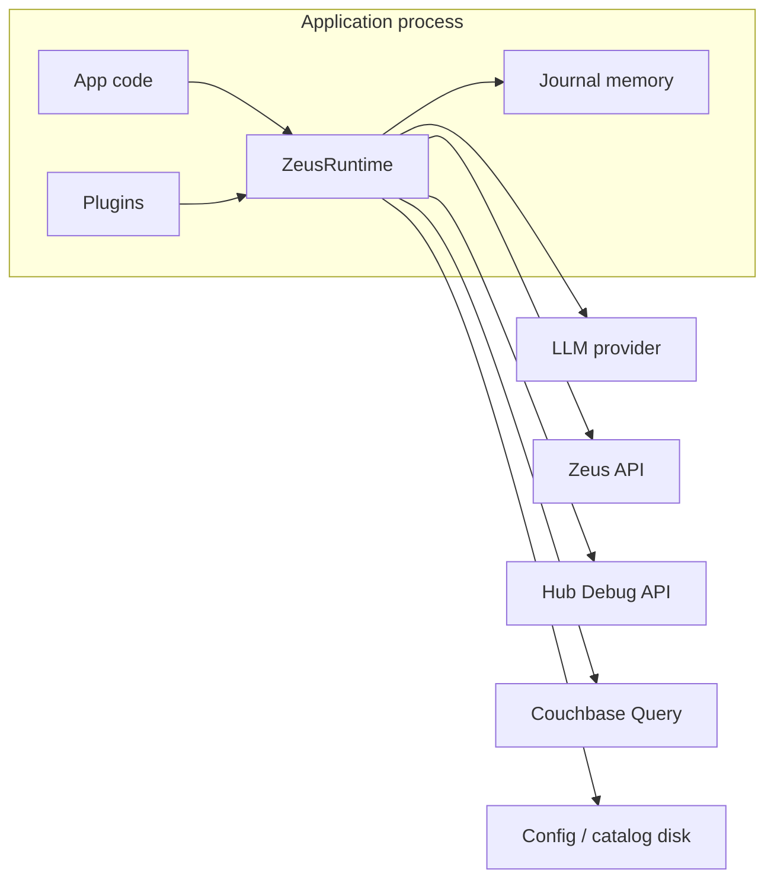

# Zeus Client V2 — Security

**Companion to:** [DESIGN.md](./DESIGN.md)  
**Scope:** Library security for `kotenai-zeus-client` V2 and its default adapters  
**Non-scope:** Hardening the Zeus server itself (covered by Zeus platform docs)

---

## 1. Security objectives

| Objective | Meaning for this client |
| --- | --- |
| Confidentiality | Credentials, tokens, PII, and prompt contents do not leak via logs, journals, traces, or errors |
| Integrity | Contract stamps, session CAS, and journal events cannot be silently corrupted by plugins |
| Availability | Client-side retries/rate limits do not amplify outages into self-DoS |
| Accountability | Security-relevant actions are attributable via redacted journal events |
| Least privilege | Default config enables only what demos need; production tightens further |
| Safe debug | World-class Detective integration without turning debug into an exfiltration channel |

---

## 2. Threat model

### 2.1 Assets

| Asset | Sensitivity | Where it appears |
| --- | --- | --- |
| Zeus Basic/session tokens | Critical | Auth adapter, HTTP headers |
| LLM API keys | Critical | LLM adapter, env/config |
| Couchbase credentials | Critical | Optional N1QL hydrate |
| User prompts & answers | High | Agent messages, journals |
| Tool args/results (PII, business data) | High | Zeus hops, journals |
| Catalog / company_context / rules | Medium–High | chat_request, inject |
| Contract hashes / session ids | Low–Medium | Debug links (ids are correlators) |
| Hub admin reachability | High | Optional debug hydrate |

### 2.2 Actors

| Actor | Intent |
| --- | --- |
| App developer | Legitimate integration; may misconfigure |
| End user | May attempt jailbreak / prompt injection via chat |
| Malicious insider with log access | Exfiltrate secrets from logs/journals |
| Network attacker on path | MITM if TLS misconfigured |
| Compromised plugin | Read secrets, alter tool args |
| Support engineer | Needs debug; should not need raw secrets |
| Supply-chain attacker | Malicious dependency |

### 2.3 Trust boundaries

| Boundary | Trust assumption |
| --- | --- |
| App → Runtime | App is trusted to pass user input; input still validated |
| Plugin → Runtime | **Untrusted by default** — sandboxed by API (no secret access) |
| Runtime → Zeus | Authenticated; TLS preferred; tool JSON **untrusted data** |
| Runtime → LLM | Provider sees prompts; treat as third party |
| Runtime → Hub Debug | Often admin plane — **opt-in**, separate policy |
| Runtime → Disk | File permissions are host’s responsibility; client avoids world-readable secrets writes |
| Journal export → external | Untrusted channel unless encrypted/signed |

### 2.4 STRIDE-style threats

| Threat | Example | Primary controls |
| --- | --- | --- |
| Spoofing | Stolen Zeus session used by attacker | Short-lived sessions, TLS, secure storage of tokens |
| Tampering | Plugin rewrites contract hash | Immutable journal; hash compute in domain; no plugin write to catalog freeze without audit |
| Repudiation | “We didn’t send that tool call” | Journal + Hub req_id correlation |
| Information disclosure | API key in exception / Detective export | Redaction, secret store, export policy |
| Denial of service | Typeahead storm / retry storm | Rate limits, retry budgets |
| Elevation of privilege | User prompt tricks agent into admin verbs | Policy/Layer A, tool allowlists, no admin APIs in default ports |

### 2.5 Explicit non-threats (out of library scope)

- Physical access to unlocked developer laptops  
- Compromised Zeus server admin  
- LLM model weight backdoors  
- Guaranteeing users never paste secrets into chat (mitigate via redaction, not prevention)

---

## 3. Authentication

### 3.1 Zeus authentication

| Mode | Use | Rules |
| --- | --- | --- |
| `none` | Local lab only | **Forbidden** in `production` profile validation |
| `basic` → session mint | Common lab/prod | `POST /v1/{bucket}/{scope}/auth/session` with Basic; cache session token in memory |
| Bearer / pre-supplied headers | Gateway pattern | Prefer injecting via `SecretStore` / header provider; never hardcode |
| Proxy auth | Edge terminated | Merge proxy headers carefully; do not log them |

**Reasoning:** Session mint reduces password exposure on every tool hop. Scoped mint path is required by Zeus (non-scoped username/password often rejected).

### 3.2 LLM authentication

- API keys only from `SecretStore` / env / explicit secure config fields.  
- Never embed keys in catalogs or journals.  
- Prefer provider-scoped keys with minimal spend limits (operational control outside library).

### 3.3 Hub Debug authentication

- Default: **no credentials, hydrate off**.  
- If enabled, use separate `HubDebugConfig` with explicit base URL and auth.  
- Do not reuse end-user Zeus data-plane tokens for admin APIs unless the deployment intentionally unifies them — document the risk.

**Reasoning:** Hub Debug is an administrative plane. Binding it into the default agent path would expand blast radius.

### 3.4 Auth caching

| Rule | Reason |
| --- | --- |
| Memory-only cache keyed by `(url, bucket, scope, user)` | Avoid disk token leakage |
| Invalidate on 401 and `session_unavailable` | Recover correctly without hammering lockout |
| No tokens in `AuthResolved` journal events | Disclosure prevention |
| Optional max TTL even if server longer | Limit stolen memory window |

---

## 4. Authorization

The client is not the primary PEP for graph data — **Zeus is**. Client responsibilities:

1. **Do not expose admin/unregister APIs** in default `ZeusPort`.  
2. **Tool allowlists** from catalog; reject unknown tool names.  
3. **No public `pipeline` helper** — multi-step plans stay in agent governance.  
4. **Mode header** must match intended product mode (analytics vs others) — prevents accidental cross-mode catalog assumptions.  
5. **Plugin permissions:** plugins cannot read `SecretStore` or raw unredacted payloads unless granted an explicit `PluginCapability.SECRETS` (default deny).  

**Reasoning:** Most privilege disasters come from “convenient” admin wrappers and over-broad plugin access, not from missing OAuth scopes in the client.

---

## 5. Secret management

### 5.1 Principles

| Principle | Implementation |
| --- | --- |
| Secrets are not config | `SecretStorePort` resolves at use; `RuntimeConfig.export()` redacts |
| No secret in `__repr__` / `__str__` | Dedicated safe representations |
| No secret in journal | Redactor + never pass secret fields into event builders |
| No secret in exceptions | `public_message` only; details redacted |
| Disk | Prefer env/OS secret manager; if file-based, chmod 600 guidance in docs |
| Rotation | `force=True` auth refresh; document key rotation without code change |

### 5.2 Secret classes

| Class | Examples | Handling |
| --- | --- | --- |
| Credentials | passwords, API keys | SecretStore only |
| Bearer/session tokens | Zeus session | Memory cache; redacted headers |
| PII payloads | emails, phones in rows | Optional field-level redaction in exports |
| Business sensitive | internal notes | Export policy tiers |

### 5.3 Recommended integrations

- Env vars for simple deploys  
- Later adapters: OS keychain, cloud secret managers (plugins)  

**Reasoning:** The library stays dependency-light while making the *port* the extension point for enterprise secret backends.

---

## 6. Token handling

| Token | Storage | Transmission | Journal |
| --- | --- | --- | --- |
| Zeus session | Memory | `Authorization` header over TLS | `[REDACTED]` |
| LLM key | Memory / env | Provider header | never |
| Chat/session/turn ids | App + journal | Correlation headers | plain (correlators) |
| `req_id` | Journal + app | Response header capture | plain |

Rules:

- Do not write tokens to catalog files.  
- Do not put tokens in URL query strings.  
- Do not reuse client-generated values as Zeus session tokens.  
- Clear auth cache on runtime close.

---

## 7. Request signing

**Current Zeus public tool plane:** session/Basic auth, not general request signing.

V2 design:

| Capability | Status |
| --- | --- |
| HMAC request signing | **Port stub** `RequestSignerPort` for future Zeus/gateway support |
| Idempotency keys | Optional header when server supports; required if tool retries enabled |
| Export signing | Optional ed25519/sigstore for journal exports in enterprise plugin |

**Reasoning:** Implementing fake signing that Zeus ignores creates a false sense of security. Provide the extension point; enable when the server/gateway contract exists.

If a reverse proxy requires JWT or mTLS:

- Configure at HTTP transport adapter (client certs, default headers from SecretStore).  
- Document in deployment guides.

---

## 8. Sensitive data masking & debug redaction

### 8.1 Redaction boundary

**All** of the following pass through `Redactor` before persistence or export:

- Journal event `data`  
- Payload store blobs used for debug  
- Structured logs  
- Exception details  
- Detective support packs  
- Compat trace dicts  

### 8.2 Default redaction policy

| Target | Behavior |
| --- | --- |
| Headers `Authorization`, `X-Api-Key`, `Cookie`, `Set-Cookie` | Replace with `[REDACTED]` |
| JSON keys matching `/password|secret|api_key|token|authorization|credit_card|ssn/i` | Redact values |
| Bearer patterns in strings | Redact |
| Email / phone (optional tier) | Mask middle when `pii_mode=strict` |
| Long bodies | Store full redacted blob by ref; event keeps preview ≤ N chars (default 2 KiB prod, 16 KiB dev) |
| System prompts | Preview + hash by default in prod; full allowed in dev profile |

### 8.3 Detective-specific rules

| Field | Rule |
| --- | --- |
| Overview KPIs | Safe (counts, ms, ids) |
| Prompt checklist | Flags + sha12 of brief/mini — not full prompt in prod default |
| Diagnosis playbooks | Error **codes** and short snippets; strip auth |
| Support pack markdown | Run through redactor |
| Hub hydrate payloads | Redact before merge into journal |

**Reasoning:** Debug fails open for *structure* (always know what happened) and fails closed for *secrets* (never need the password to debug boundary misconfig).

### 8.4 G2 / policy artifacts

Jailbreak scores, wish_i_knew, and refuse reasons:

- Allowed in structured artifacts / detective  
- **Never** concatenated into user-facing `answer`  
- Not written to third-party analytics without policy review  

---

## 9. Secure logging

| Rule | Reason |
| --- | --- |
| Default log level INFO in prod | Reduce payload temptation |
| Log `ErrorCode`, latencies, ids — not bodies | Enough for SRE |
| DEBUG bodies only if `logging.allow_bodies=true` AND non-prod profile | Dual gate |
| Use structured logging (`key=value` or JSON) | Avoid string interpolation of headers |
| Correlate with `turn_id` | Support without dumping prompts |
| Never log full `zeus_headers` | Classic leak |

Bridge: `StructuredLogBridge` maps selected journal events → logs **after** redaction.

---

## 10. Replay attack prevention

Threats:

1. **Network replay** of Zeus tool calls (attacker)  
2. **Accidental replay** of non-idempotent verbs by client retries  
3. **Malicious journal replay** in app (support tooling abuse)

### Controls

| Control | Detail |
| --- | --- |
| No default retries on POST tools | Prevent amplification and duplicate side effects |
| Fresh `X-Zeus-Call-Id` / never reuse `X-Zeus-Req-Id` across hops | Avoid TraceDoc collision and confused joins |
| Session turn CAS / round guards | Server rejects stale writes |
| Transport replay is local-only | Fake ports; does not re-fire network unless `ReplayMode.LIVE` |
| LIVE replay requires explicit flag + confirmation in CLI | Human gate |
| Optional idempotency keys when enabling retries | Future-safe |
| Export encryption optional | Stolen export ≠ instant replay against prod without creds (creds not inside export) |

**Reasoning:** True cryptographic anti-replay is a server property (nonces). The client’s job is to avoid creating replay-prone behavior and to keep debug replay offline-by-default.

---

## 11. Rate limiting

| Surface | Default | Reason |
| --- | --- | --- |
| Typeahead (`search`) | Client token bucket per runtime (e.g. 10 rps, burst 20) configurable | UI storms |
| Agent turns | App-level; library exposes optional limiter hook | Business-dependent |
| Auth mint | Max attempts + respect lockout; backoff | Avoid 429 lockout spirals |
| Hub hydrate | 1 concurrent, timeout short | Admin plane protection |
| Retries | `RetryBudget` per turn | Tail latency + thundering herd |

Metrics should count `rate_limited` decisions for visibility.

---

## 12. Input validation

### 12.1 External inputs

| Input | Validation |
| --- | --- |
| User message | Max length; reject non-text types; normalize newlines |
| Tool args from LLM | JSON schema from catalog; strip unknown keys optional; size cap |
| `DataTarget` | Non-empty bucket/scope/collection; charset allowlist |
| Mode | Enum / allowlist |
| Session ids | Format/length sanity before URL interpolate |
| Config files | Schema validation; unknown fields warn |
| Plugin names | Safe charset |

### 12.2 Untrusted tool JSON

**Rule:** Zeus tool results are **untrusted data**, never executable code, never trusted for security decisions without validation.

- Parse with size limits  
- Do not `eval`  
- Do not render as HTML without escaping in consumer apps (document for BFF/UI)  
- Layer A parse must be defensive  

### 12.3 Header injection

- Correlation IDs: allow only safe charset (`[A-Za-z0-9._:-]`), max length  
- Mode header: allowlist  

**Reasoning:** CRLF/header injection is rare in httpx but cheap to prevent at the boundary.

---

## 13. Dependency security

| Practice | Detail |
| --- | --- |
| Minimal runtime deps | `httpx` + small utilities; avoid heavy stacks in core |
| Pin in lockfiles for apps | Library uses compatible ranges; apps pin |
| `pip audit` / OSV in CI | Fail on known critical CVEs |
| Prefer well-maintained HTTP stacks | httpx |
| No shell-outs in core | Eliminate command injection class |
| Review optional OTLP exporter deps | Extra extra; don’t force on all users |
| Disable arbitrary pickle | Journals are JSON only |

**Reasoning:** A client library’s supply chain is the user’s supply chain. Every dependency is a promise.

---

## 14. Secure defaults

| Setting | Production default | Dev default |
| --- | --- | --- |
| `zeus.auth_mode` | must not be `none` | `none` allowed |
| TLS verify | **true** | true (override explicit) |
| Redaction | **strict** | standard |
| Full prompt in journal | **false** | true |
| Force trace header | **false** | optional true |
| Detective briefing | true (local pure) | true |
| Hub hydrate | **false** | false |
| Tool POST retries | **false** | false |
| Log bodies | **false** | optional |
| Pipeline public API | disabled | disabled |
| Compat v1 verbose traces | redacted | redacted |

Validation: `RuntimeConfig.validate(profile)` fails closed on insecure prod combos.

**Reasoning:** Secure defaults beat documentation. Developers can loosen deliberately; they should not have to harden from a lab-shaped default.

---

## 15. Error messages & information disclosure

| Audience | Content |
| --- | --- |
| End user (`answer` / public_message) | Helpful, non-internal (“service temporarily unavailable”) |
| App developer (exception / structured error) | `ErrorCode`, component, safe details, hub links |
| Support (journal / support_pack) | Redacted rich context |

Never include:

- Stack traces in user answers  
- Auth headers  
- Full env dumps  

---

## 16. Multi-tenant / session isolation

Threat: durable Zeus session **bleed** (detail page pollutes discovery chat).

Controls:

| Control | Owner |
| --- | --- |
| Distinct `chat_id` per product surface | App |
| `SessionHandle` not global singleton in library | Library |
| Runtime refuses implicit “last session” reuse | Library |
| Document demo isolation patterns | Docs / demo-builder |

**Reasoning:** Many “retrieval bugs” are session isolation bugs. The library must not paper over app mistakes with hidden globals.

---

## 17. Plugin security model

| Capability | Default |
| --- | --- |
| Read redacted events | allow |
| Append annotation events | allow |
| Mutate tool args | allow but journal before/after |
| Block hop (`critical`) | allow with audit event |
| Read secrets | **deny** |
| Disable redactor | **deny** |
| Write catalog stamps | **deny** |

Load plugins explicitly in code — **no** entry-point auto-load from untrusted dirs in prod profile.

---

## 18. Transport security

| Control | Default |
| --- | --- |
| HTTPS preferred | Warn on HTTP in prod profile |
| Certificate verification | On |
| Timeouts | Always set (connect + read) |
| Max response size | Configurable cap before parse |
| Redirect policy | Conservative; do not follow cross-host redirects with auth by default |

---

## 19. CI/CD security recommendations

- No secrets in git; use CI secret stores  
- PR CI without prod credentials  
- Integration tests against ephemeral/lab only  
- Signed releases (tag + optional package attestation)  
- SBOM generation on release  
- Branch protection + required reviews for `security/` and auth adapters  

---

## 20. Incident response (library consumers)

If a secret may have entered logs/journals:

1. Rotate Zeus passwords, LLM keys, CB creds.  
2. Invalidate Zeus sessions (restart/mint).  
3. Purge exported journals containing the era.  
4. Upgrade client if bug; add regression test.  
5. Check Hub retention for mirrored traces.

Library maintainers: security contact in README; private disclosure window before CVE details.

---

## 21. Control mapping summary

| Area | Primary mechanism |
| --- | --- |
| Authentication | Scoped session mint + SecretStore |
| Authorization | No admin surface; allowlists; plugin caps |
| Secret management | Port + redaction + safe repr |
| Token handling | Memory cache; never journal |
| Request signing | Future port; mTLS/JWT at transport |
| Masking | Redactor at journal boundary |
| Debug redaction | Export tiers + detective policy |
| Secure logging | Structured, dual-gated bodies |
| Replay prevention | No POST retries; offline replay default |
| Rate limiting | Typeahead bucket + retry budget |
| Input validation | Schema/size/charset |
| Dependencies | Minimal + audit |
| Secure defaults | Profile validation |

---

## 22. Reasoning appendix — why not weaker alternatives

| Alternative | Why rejected |
| --- | --- |
| “Debug only in Hub; client stays dumb” | External multi-hop is invisible; fails primary goal |
| Full payloads always in logs | Guaranteed secret leakage over time |
| Encrypt journal with key embedded in library | Theater; key extraction trivial |
| Auto-load all plugins on sys.path | Supply-chain + persistence risk |
| Retry all Zeus POSTs | Data corruption + replay |
| Trust LLM tool args blindly | Prompt injection → dangerous calls |
| Single global client with cached last password | Multi-tenant bleed + testing hell |

---

## 23. Implementation checklist (security)

- [ ] `SecretStorePort` + no secrets in config export  ✅  
- [ ] Redactor on journal append and exports  ✅  
- [ ] Prod profile rejects `auth_mode=none` and TLS verify off  ✅ (ZCP-36 cutover)  
- [ ] Tool retries default off  ✅  
- [ ] Typeahead rate limiter  ✅ (ZCP-22)  
- [ ] Header charset validation  (partial / adapter)  
- [ ] Plugin capability deny-by-default for secrets  N/A (`plugins=no`)  
- [ ] Support pack redaction tests  ✅ (detective/support path)  
- [ ] `pip audit` in CI  deferred  
- [ ] Session isolation: no implicit last-session  ✅  
- [ ] Hub hydrate opt-in  ✅  
- [ ] LIVE replay gated  ✅ 

---

## 24. Residual risks

| Risk | Status |
| --- | --- |
| User pastes API key into chat | Redact patterns; educate |
| Zeus server returns sensitive data in tool body | Field policies optional; app filtering |
| Memory scraping of process | OS/runtime concern |
| Admin Hub open on LAN without auth | Deployment issue; client default avoids hydrate |
| LLM provider training on prompts | Contractual/provider setting outside library |

These are accepted with documentation rather than false guarantees.
