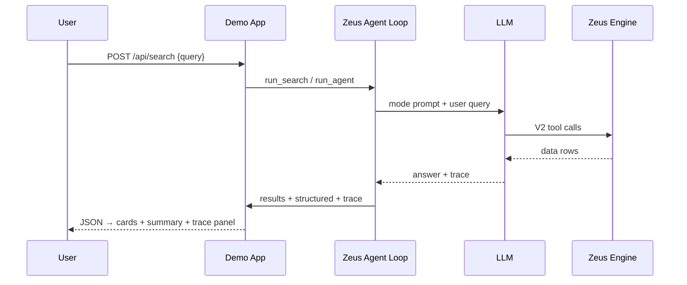

# Architecture

**Status**: Draft  
**Related**: [RECIPES.md](RECIPES.md), [REFERENCE_TRAVELPLAN.md](REFERENCE_TRAVELPLAN.md)

---

## 1. Layer diagram

```text
UI (templates / static)
  → HTTP API (Flask or FastAPI)
    → domain search wrapper (run_agent + domain prompt)
      → result extractors (structured → cards → markdown fallback)
      → chat store (turns + zeus_session_id / zeus_round)
    → async lifecycle (background loop OR native async)
    → zeus_config (env before import)
  → kotenai-zeus-client
      → LLM provider
      → Zeus Engine
```

<!-- TODO: Optional mermaid flowchart -->

---

## 2. Sequence diagram



<!-- TODO: Align field names with API_CONTRACT -->

---

## 3. Module responsibility table

| Module (generic) | Responsibility | TravelPlan reference |
|------------------|----------------|----------------------|
| `zeus_config` | Env paths before import | `zeus_config.py` |
| `async_runner` / lifespan | HTTP client + sync startup | `async_runner.py` |
| `search` | Domain `run_agent` wrapper | `search.py` |
| `output_schema` | Card field allowlist | `output_schema.py` |
| `results_parser` | Trace → cards | `results_parser.py` |
| `answer_parser` | Markdown → structured fallback | `answer_parser.py` |
| `chat_store` | Multi-turn persistence | `chat_store.py` |
| `app` | Routes | `app.py` |
| templates/static | UI + vendored trace JS | `templates/`, `static/` |

---

## 4. App-owned vs library-owned

| Concern | Owner |
|---------|--------|
| Agent loop, auth, catalog load, dispatch | Library |
| `config.json` location / project layout | App |
| Chat UI state / JSONL store | App |
| `output_schema` for cards | App |
| Result card mapping | App |
| Trace panel embed | App (vendored asset) |

---

## 5. Sync vs async deployment

| Framework | Pattern | Recipe |
|-----------|---------|--------|
| Flask (sync) | Background event loop + `run_coro` | R02 |
| FastAPI (async) | Native `async` routes + lifespan | R02b |

<!-- TODO: Expand with lifecycle diagrams -->
